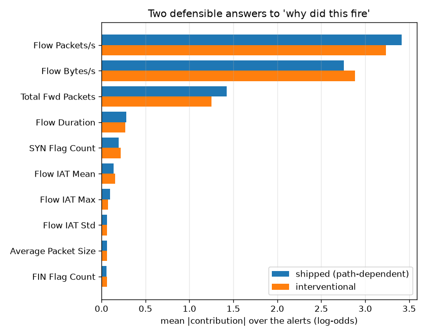
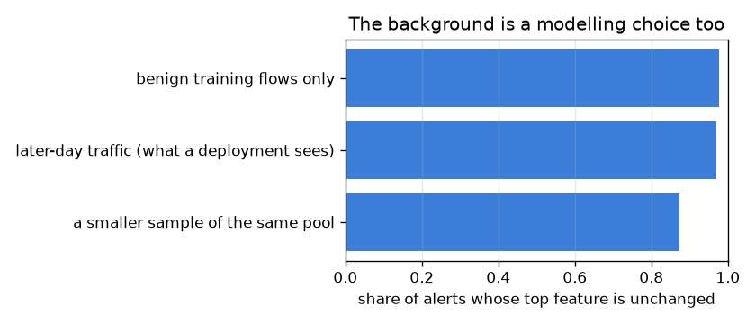

# NetSentry — Which Shapley Value Does the API Ship?

_Both TreeExplainer estimands on the 300 alerts the deployed model raises at a
1% false-positive budget, graded against the coalition sum on a
8-feature model where it can be computed exactly, plus a third estimand
the shipped one is often confused with. Regenerate with `netsentry shapaudit`._

## Why this report exists

`/predict` returns `top_features`, and the code that produces them calls
`shap.TreeExplainer(model)` with no background data. That is a defensible choice and it is also
a *choice*, because "the SHAP value of this feature" is not one quantity:

- **Path-dependent** (the default, and what this project ships): missing features are
  integrated out using the training distribution *as the tree recorded it* -- the coverage
  counts stored in each node.
- **Interventional** (Lundberg 2020; Janzing, Minorics & Bloebaum 2020): missing features are
  replaced from a background sample independently of the rest, breaking correlations. It
  answers "what does the output owe to this input".
- **Conditional**: missing features are drawn from their distribution *given* the ones being
  held. It answers "what does this feature tell you about the output".

Two of those three are commonly used interchangeably in write-ups. They are not the same
number.

**The library is doing exactly what it claims, and what it claims is not what most people think they are reading.**

First the easy part. TreeExplainer's interventional output matches the definition -- a weighted sum over all 256 coalitions, computed by brute force on a 8-feature model -- to 5e-09. The fast algorithm is correct.

Then the part that matters. On the 300 alerts the API actually explains, the shipped estimand and the interventional one agree closely: rank correlation 0.964, and they name the same top feature for 96.3% of alerts. The choice changes the headline of roughly one alert in 27.

But agreeing with the interventional quantity is itself the finding, because it is *not* what the shipped estimand is usually described as computing. Duplicate a feature before training, let the model split on one copy (120 times) and never on the other (0), and ask all three quantities what the spare copy contributed. The shipped answer is **0.0000**. The interventional answer is 0.0000. The *conditional* answer -- the one people mean when they say SHAP accounts for correlations -- is **0.0438**, exactly half the original's credit, because two identical features are exchangeable and Shapley's symmetry axiom leaves no choice.

So `top_features` answers *what did this input do*, not *what does this feature tell you*. That is a defensible thing for a detection API to answer. It was not a decision anybody recorded.

## Is the library computing what it says?

| check | worst error | tolerance | verdict |
|---|---|---|---|
| TreeExplainer (interventional) against the coalition sum | 5.07e-09 | 1e-04 | pass |
| efficiency: contributions + baseline reproduce the score | 6.15e-09 | 1e-04 | pass |
| efficiency of the shipped estimand on the deployed model | 7.99e-14 | 1e-04 | pass |

Shapley values are defined by a sum over every coalition, and TreeExplainer's contribution is
computing them in polynomial time by exploiting the tree structure. That is worth checking
against the definition at least once, on a model small enough for the definition to be
affordable: 8 features is 256 coalitions, which is
seconds rather than days. The efficiency rows check the axiom that makes the numbers additive
at all -- contributions plus baseline must reproduce the score -- for both the small model and
the deployed one.

An explanation nobody has validated is an assertion with a colour scheme.

## How far apart are the two estimands here?

| population | flows | rank correlation | same top feature | top-3 overlap | magnitude ratio |
|---|---|---|---|---|---|
| the alerts the API explains | 300 | 0.964 | 96.3% | 90.0% | 1.019 |
| a random sample of later-day flows | 300 | 0.971 | 85.0% | 84.8% | 1.057 |

The two agree on the top feature for 96.3% of alerts and on 90.0% of the top-3 set -- which is the list
the API returns. Agreement is
higher on
alerts than on ordinary traffic, which is the direction that matters: the flows an analyst
actually reads are the ones the two methods most nearly agree about.

| feature | splits in the model | shipped (path-dependent) | interventional | ratio |
|---|---|---|---|---|
| `Flow Packets/s` | 1,079 | 3.4169 | 3.2331 | 1.06x |
| `Flow Bytes/s` | 1,108 | 2.7545 | 2.8844 | 0.95x |
| `Total Fwd Packets` | 1,215 | 1.4263 | 1.2510 | 1.14x |
| `Flow Duration` | 1,088 | 0.2829 | 0.2699 | 1.05x |
| `SYN Flag Count` | 781 | 0.1952 | 0.2176 | 0.90x |
| `Flow IAT Mean` | 783 | 0.1404 | 0.1534 | 0.92x |
| `Flow IAT Max` | 802 | 0.0967 | 0.0754 | 1.28x |
| `Flow IAT Std` | 470 | 0.0645 | 0.0652 | 0.99x |
| `Average Packet Size` | 458 | 0.0605 | 0.0626 | 0.97x |
| `FIN Flag Count` | 447 | 0.0556 | 0.0619 | 0.90x |

The reason they agree so well is a property of this data rather than of the methods. The
interventional and conditional quantities coincide exactly when features are independent, and
the [kernel two-sample study](mmd.md) already measured this stand-in's modelled features at a
mean absolute pairwise correlation of **0.005**. On traffic with real feature coupling the gap
would open, and the correct reading of this table is "the choice is currently cheap here", not
"the choice does not matter".

## The experiment with a ground truth

| feature | splits | shipped (path-dependent) | interventional | conditional (k = 24) | conditional (k = 6) |
|---|---|---|---|---|---|
| `Flow Duration` (the copy the model uses) | 120 | 0.1795 | 0.1638 | **0.0438** | **0.0699** |
| `Flow Duration` (the identical copy it never splits on) | 0 | 0.0000 | 0.0000 | **0.0438** | **0.0699** |

A feature is duplicated before training and column subsampling is switched off, so the tie
between the copies is broken deterministically and one of them is **never split on** --
verified by counting splits in the dumped model, not assumed. Then all three quantities are
asked what the unused copy contributed.

Two of the three answers are provable before they are measured, which is why this is the
experiment worth running. Interventional attribution must give the unused copy **exactly zero**:
intervening on a feature the model never reads cannot change the output. Conditional
attribution must give the two copies **exactly the same credit**: they are identical columns,
so no value function can distinguish them and Shapley's symmetry axiom leaves no choice. Both
hold in the table, and the conditional column holds at either smoothing setting, because the
equality is a property of the estimand rather than of the estimator.

What is *not* provable is the conditional magnitude, and the two k columns are there to stop it
being read as if it were. ``E[f | X_S = x_S]`` has no closed form for an empirical
distribution; it is estimated by averaging over the k nearest background rows in the held
subspace, and a larger k smooths every attribution toward zero. The ratio between the
conditional and the shipped column moves with k. The symmetry does not.

The shipped estimand returns 0.0000 for the
unused copy. **It sides with the interventional answer**, and for a structural reason rather
than a statistical one: a feature with no nodes has no paths to walk, whatever the correlation
structure says. That is worth knowing, because "path-dependent SHAP accounts for feature
correlations" is a sentence that appears in a great many write-ups, including ones this
project's own documentation could have written.

## The estimand has a second free parameter

| background sample | rows | same top feature as the reference | rank correlation | cost |
|---|---|---|---|---|
| benign training flows only | 200 | 97.7% | 0.966 | 36 s |
| a smaller sample of the same pool | 25 | 87.3% | 0.935 | 11 s |
| later-day traffic (what a deployment sees) | 200 | 97.0% | 0.962 | 35 s |

Interventional attribution is defined against a background distribution, and the background is
a modelling choice too. Reference here is a uniform sample of the training split;
the weakest agreement is 87.3% with a smaller sample of the same pool, so the answer moves with the reference in the same way it moves with the
estimand. A background
of later-day traffic answers "why is this flow unusual *now*"; a benign-only background answers
"why is this flow not benign". Those are different questions and the API currently asks neither
explicitly.

## What this changes

- **The contract should say which quantity it returns.** `top_features` answers *what did this
  input do*, which is the right answer for a detection API -- an analyst wants to know what to
  look at in the flow, not what the flow correlates with. Saying so is free.
- **A correlated deployment would need the choice revisited.** The measured agreement here
  rests on near-independent features. On real CIC-IDS2017 traffic, where forward and backward
  packet statistics move together, the gap would be larger and the argument would have to be
  made rather than inherited.
- **Nothing here says the explanations are wrong.** It says they answer one of three
  questions, that the library computes that answer correctly to nine decimal places, and that
  the question had never been written down.

## Scope and honest limits

- **The conditional estimand is estimated, not exact.** ``E[f | X_S = x_S]`` has no closed form
  for an empirical distribution; it is approximated here by averaging over the
  8-dimensional nearest neighbours of the held subspace. The duplicate
  experiment does not depend on that approximation being accurate -- symmetry pins the answer
  -- but the magnitudes elsewhere would.
- **The exact reference is a small model.** 8 features and a short
  ensemble; the deployed model has 76. What is validated is the algorithm, not
  the deployed numbers, and that is the only thing brute force can validate.
- **Agreement is measured, causation is not.** That two estimands name the same top feature
  does not make that feature the reason for the alert. The
  [anchors study](anchors.md) and the [counterfactual study](recourse.md) attack that question
  from directions attribution cannot.
- **This is one dataset and one model family.** TreeExplainer's path-dependent mode is specific
  to trees; the same question for a neural model is a different implementation with different
  failure modes, and the [deep-tabular study](deep_tabular.md) would be where to ask it.