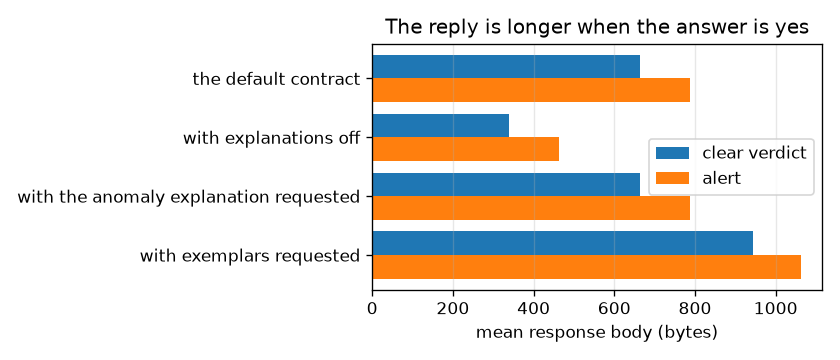
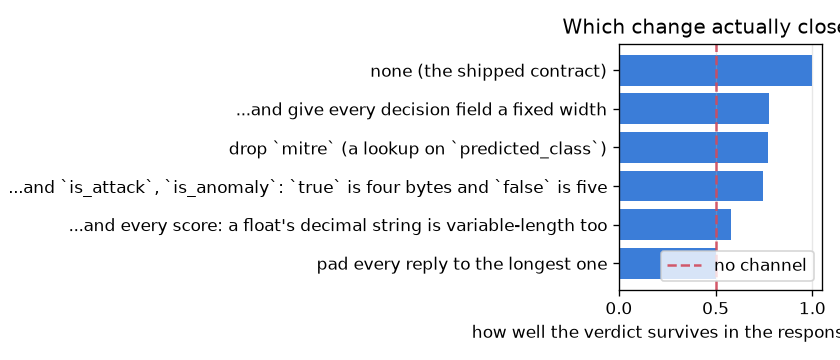

# NetSentry — The API Answers Twice

_120 later-day flows driven through the real application under four endpoint
configurations, with the reply's length and latency recorded beside the verdict.
15% of them were alerts. Regenerate with `netsentry sidechannel`._

## Why this report exists

Everything this project does about adversaries assumes the attacker learns the verdict by
**being told** it: through the API, under an API key, inside a rate limit, with every query
counted. The [extraction study](extraction.md) prices what those queries buy; the
[control-loop study](control.md) prices what an attacker can do by generating alerts. Both
defences are query-side, and both assume there is no other way to find out.

There is another way, and it is written into the response contract. `mitre` is `null` for a
clear verdict and an object for an alert. The optional anomaly explanation is computed **only
for flows the detector flagged**. `recommended_action` and `prediction_set` change length with
the decision. So an observer who can see encrypted traffic between a sensor and the service --
a network position, a shared host, a co-tenant -- reads the verdict off the packet lengths
without decrypting anything.

**The verdict is recoverable from the length of the reply, exactly, on every endpoint configuration tested.** Size alone separates alerts from clear flows at AUC 1.000, and a single cut on the byte count recovers the verdict for 100% of 120 flows. An alert's body runs +123 bytes longer than a clear one's, and turning explanations off does not help -- it makes every reply smaller and leaves the gap intact.

**There is no timing channel worth having**, and the reason is almost funny. Latency separates the two classes at AUC 0.615, which is noise, because SHAP runs unconditionally and costs a quarter of a second -- so the conditional work hides underneath the unconditional work. The most expensive thing in the request path is what conceals the cheap signal.

The part worth reading is the fix. The obvious one is to stop returning the field that appears only on alerts, and it takes the channel from 1.000 to 0.772 -- **not to 0.5**. Four successive corrections, each of which an engineer would reasonably believe was the fix, leave it at 0.578: better than a coin, from nothing but the length of an encrypted reply. Padding closes it, at +125 bytes.

**You cannot enumerate your way out of a length channel**, because the last thing leaking is the thing the contract exists to return.

## The channel, measured

| endpoint | mean reply, clear | mean reply, alert | size AUC | verdict recovered from size alone | latency AUC |
|---|---|---|---|---|---|
| the default contract | 664 B | 787 B | **1.000** | 100.0% | 0.615 |
| with explanations off | 338 B | 464 B | **1.000** | 100.0% | 0.603 |
| with the anomaly explanation requested | 664 B | 787 B | **1.000** | 100.0% | 0.631 |
| with exemplars requested | 944 B | 1062 B | **1.000** | 100.0% | 0.574 |

The AUC column is reported as `max(auc, 1 - auc)`, because an attacker does not care which way
the channel points: a body reliably *shorter* on an alert leaks exactly as much as one that is
longer.

Every configuration leaks totally. Turning explanations off with `?explain=false` -- the
throughput switch the benchmark documents -- takes the alert reply from
787 bytes down to
464 and leaves the gap between verdicts intact, because
the fields that vary are not the ones being removed. Requesting the anomaly explanation or the
exemplars does not change the picture either: they add bytes to *some* replies, which is the
same failure again rather than a new one.

## Which fields carry it

| field | present on | mean bytes |
|---|---|---|
| `mitre` | **alerts only** | 138 B |
| `top_features` | always | 327 B |
| `anomaly_score` | always | 18 B |
| `attack_probability` | always | 18 B |
| `prediction_set` | always | 13 B |
| `threshold_profile` | always | 12 B |
| `recommended_action` | always | 11 B |
| `predicted_class` | always | 8 B |
| `model_version` | always | 7 B |
| `is_anomaly` | always | 5 B |
| `is_attack` | always | 5 B |

A field marked **alerts only** is a channel by itself whatever its size, because its *presence*
is the signal -- a one-byte field would do as well as a hundred-byte one. The only field exclusive to one verdict is `mitre`: 138 bytes of ATT&CK context attached to alerts and omitted otherwise.

The tempting conclusion from this table is that the fields marked *always* are innocent. They
are not, and the next section is the demonstration: a field that is always present still leaks
if its **length** varies with the verdict, which is true of every number the contract returns.

## What closes it, and what that costs

| change | size AUC after | bytes per reply |
|---|---|---|
| none (the shipped contract) | **1.000** | +0 B |
| drop `mitre` (a lookup on `predicted_class`) | **0.772** | -33 B |
| ...and give every decision field a fixed width | **0.775** | +13 B |
| ...and `is_attack`, `is_anomaly`: `true` is four bytes and `false` is five | **0.745** | +55 B |
| ...and every score: a float's decimal string is variable-length too | **0.578** | +71 B |
| pad every reply to the longest one | **0.500** | +125 B |

**Dropping the ATT&CK object should have been free and is not enough.** It is a lookup on
`predicted_class`, which the response already carries and whose mapping is published, so
returning it is redundant -- and removing it makes every reply smaller. It also takes the
channel from a perfect 1.000 down to 0.772, which is still an attacker recovering the verdict
most of the time.

What follows is a lesson in what "variable-length field" means. Giving the decision fields a
fixed width changes almost nothing. Normalising the booleans helps a little, because `true` is
four bytes and `false` is five. Normalising the scores helps a lot, because `0.01` is four
characters and `0.9871234` is nine -- a probability is a variable-length field and nobody thinks
of it as one. And after all four corrections the channel still sits at 0.578, carried by the
field hardest to give up: `top_features` is a list of floating-point contributions, so **the
explanation the API exists to return is itself a length that depends on the answer**.

Padding is therefore the guarantee rather than the optimisation. It closes the channel by
construction, at a fixed cost per reply, and it is the only rung whose correctness does not
depend on somebody enumerating every variable-length field correctly -- this time, and again
the next time the contract changes.

## Scope and honest limits

- **This is an in-process measurement.** Client and server share a process, so the latency
  numbers carry none of the network's noise and the sizes carry none of TLS's record padding or
  HTTP/2's header compression. TLS does not hide length; it obscures it a little, and an
  attacker who sees many requests averages that away. The size result would survive; the timing
  non-result might not, in either direction.
- **The verdict, not the label.** What leaks is what the service *decided*, which is what an
  evading attacker wants: a free, passive, unlimited feedback signal for tuning a flow until it
  stops being flagged. It is not a leak of the ground truth, and it is not a leak of the model.
- **The threat needs a position.** An attacker who cannot observe the sensor-to-service path
  gets nothing here. The realistic cases are a shared segment, a compromised collector, or a
  managed-detection deployment where the customer's traffic to the vendor crosses networks the
  attacker already sits on.
- **Batch endpoints are worse and are not measured.** `/predict/batch` returns one body for many
  flows, so its length is roughly linear in the number of alerts -- a *count* rather than a bit.
  Padding a batch reply to a constant length costs proportionally more, which is exactly the
  case where the cheap fix is least attractive.
- **Nothing here is exotic.** This is the oldest side channel there is, applied to an ML
  service's response contract rather than to a login form. It is in the report because the
  contract was designed to be read by a human and nobody asked what its shape says out loud.