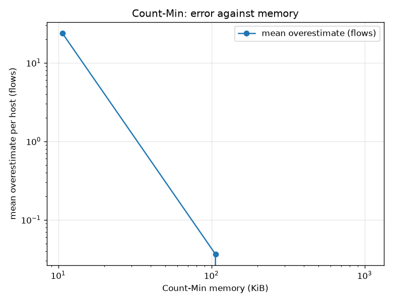
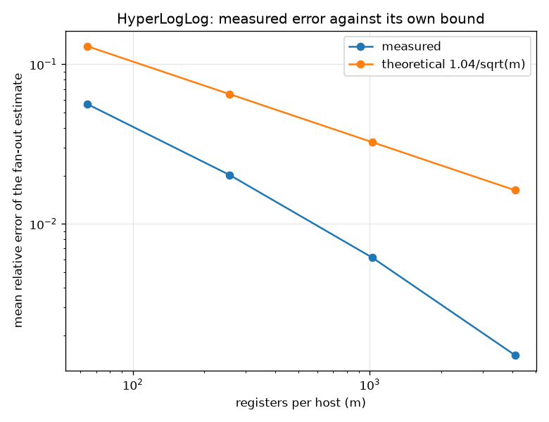

# NetSentry — Counting Without Remembering

_Synthetic host stream: 51,800 flows from 1,481 sources, Zipf-skewed,
with 3 planted scanners touching 600 destinations each._

## Why this report exists

The [host-graph analytics](graph_demo.md) find scanners by counting distinct destinations per
source. That is a set per host, and sets grow with what they hold. On a link doing tens of
thousands of flows a second, "keep a set per host" is not a tuning problem, it is a design
that runs out of memory during the incident it was bought for. Production flow analytics use
**sketches**: fixed-size structures answering the same question with a stated error, in memory
that does not grow with the stream.

Four are implemented here from scratch, and — more to the point — every guarantee each of them
makes is checked against exact ground truth rather than cited.

## Count-Min: per-host flow counts that never undercount

| epsilon | table | memory | mean overestimate | worst | ever under? | within the bound |
|---|---|---|---|---|---|---|
| 0.01 | 5 x 272 | 10.6 KiB | 23.9 flows | 150 | never | 100.0% |
| 0.001 | 5 x 2,719 | 106.2 KiB | 0.0 flows | 8 | never | 100.0% |
| 0.0001 | 5 x 27,183 | 1,061.8 KiB | 0.0 flows | 0 | never | 100.0% |

**No sizing ever undercounted a single host**, which is the property that makes this structure safe to detect with: a sketch that could report a scanner as quieter than it was would hide it, and one that can only exaggerate merely wastes an analyst's time. Error buys down with memory exactly as the bound says it should: at epsilon = 0.01 the sketch costs 10.6 KiB and overestimates a host by 24 flows on average, and at epsilon = 0.0001 it costs 1,061.8 KiB for 0.0. The number that does not appear in that sentence is the one that matters most: **none of these sizes depend on how many hosts the stream contains**. The exact counter grows with the traffic; the sketch is the size you chose when you deployed it, and stays there through the incident that quadruples your host count.

## HyperLogLog: fan-out in a few kilobytes

| precision | registers | memory (all hosts) | measured error | 1.04/sqrt(m) | top-k agreement | scanners in top-k |
|---|---|---|---|---|---|---|
| p = 6 | 64 | 92.6 KiB | 5.65% | 13.00% | 80% | 3/3 |
| p = 8 | 256 | 370.2 KiB | 2.02% | 6.50% | 90% | 3/3 |
| p = 10 | 1,024 | 1,481.0 KiB | 0.61% | 3.25% | 100% | 3/3 |
| p = 12 | 4,096 | 5,924.0 KiB | 0.15% | 1.62% | 100% | 3/3 |

Measured error tracks the theoretical `1.04/sqrt(m)` at 4 of 4 precisions, so the estimator is behaving as advertised. The operational question is the one after that, and it is not the same question: a fan-out estimate 2% wrong is worthless if the 2% lands on the ordering of the shortlist an analyst reads. At p = 12 the top-10 ranking agrees with exact counting 100% of the time, and all 3 planted scanners are still inside the top 10. That is the argument for sketches in its general form: scan detection is a *ranking* problem, and an error of a couple of percent is far smaller than the gap between a scanner at 600 destinations and the busiest ordinary host at 38. It is also the shape of the failure mode — two candidates genuinely close together can be reordered by the approximation, and no amount of precision removes that, it only makes the window narrower.

## What it saves

Over 51,800 flows from 1,481 sources, exact per-host destination sets occupy 155 KiB and the smallest HyperLogLog configuration answers the same question in 93 KiB — a 2x reduction.

And here the report has to argue against its own thesis, because the numbers do. At p = 8 and above the sketch costs **more** than exact counting (5,924 KiB against 155), and that is not a bug. This design keeps one HyperLogLog per source, so its memory scales with the number of *sources* while an exact set scales with each source's *fan-out*. On this stream ordinary hosts touch at most 38 peers, and a few dozen integers are cheaper than four thousand registers. Sketches pay when cardinality per key is large; here it is small for almost every key, and the honest recommendation is the low-precision configuration or exact sets, not the sketch that sounds most impressive. What does not change is the *shape*: exact memory is unbounded in fan-out and the sketch is not, so the moment one host starts touching millions of peers — which is the moment a scan detector exists for — the ordering reverses and never comes back.

## Heavy hitters and the uniform sample

Misra-Gries recovered **100%** of the hosts genuinely above a 1/32 share of the stream, which is what its guarantee promises: every true heavy hitter appears, though the summary also contains candidates that are not, so it is a shortlist to verify rather than an answer. The reservoir's composition is statistically indistinguishable from the stream it sampled (chi-square p = 0.95), which is the only property that makes a one-pass fixed-memory sample worth having.

## Scope

The stream is **synthetic**, and deliberately so. Cleaning drops the identity
columns before any model sees them — that is the leakage contract this whole project rests on
— so the flow table available downstream has no source or destination to count. The stream is
Zipf-distributed over sources with planted scanners because a uniform stream would flatter
every structure here: hash collisions hurt most under skew, which is precisely the regime real
traffic is in. What is being validated is the implementations and their bounds, and those
claims are distribution-free in the directions that matter (Count-Min's guarantee holds for
any stream; HyperLogLog's depends only on hash quality).

Memory figures count the structures themselves, not Python object overhead, which would swamp
them at this scale and says more about the interpreter than about the algorithms. A production
sensor would pack the HyperLogLog registers at six bits rather than eight and keep them off
the heap entirely, so the per-host figure here is an overestimate of what the method costs.

The per-source HyperLogLog design keeps one sketch per source, so memory grows with the number
of *sources* even though it does not grow with their fan-out. That is the right trade for scan
detection — sources are bounded by the address space you monitor and destinations are not — but
it is a design decision rather than a property of the algorithm, and a deployment watching a
wider address space would need a second layer of approximation on top.