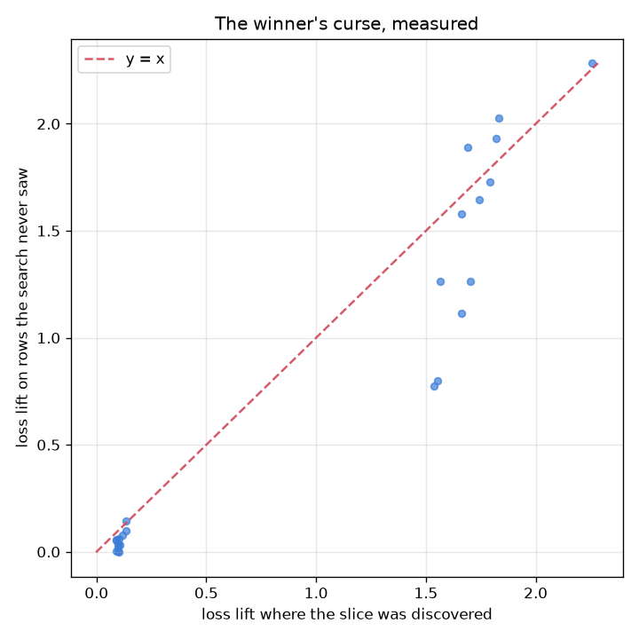

# NetSentry — Letting the Failures Find Themselves

_A SliceFinder-style beam search (Chung et al., ICDE 2019) over 760 binned
feature literals to depth 2, with Benjamini-Hochberg multiplicity control at
q = 0.05, a permuted-loss null calibration, and every surviving slice re-measured on a
held-out confirmation half._

## Why this report exists

The [per-class](slices.md) and [per-service](subgroups.md) studies both slice the test set on a
partition somebody chose in advance, so both can only find weaknesses somebody had a hypothesis
about. The failures that reach production are the other kind. This searches for them — and
spends most of its effort on not being fooled by the search.

## The null, before any finding

| search | candidates tested | significant at p <= 0.05 | significant after BH | largest loss lift |
|---|---|---|---|---|
| **permuted losses (nothing is real)** | 19,418 | 2,249 | **0** | 0.511 |
| the deployed model | 19,338 | 6,443 | **4,335** | 2.257 |

The search tests **19,338 candidate regions**. If those tests were independent, an uncorrected 5% level would flag about 967 of them in a model with no weaknesses whatsoever; the permuted-loss run flags 2,249, and the excess is the candidates overlapping each other — a slice and its refinements are nearly the same set of flows, so their test statistics move together and the tail is heavier than independence predicts. Benjamini-Hochberg takes it to **0**. That first row is the reason this report starts with a null rather than a leaderboard. A slice search is a multiple-comparisons problem wearing an engineering hat, and its failure mode is not a wrong number — it is a plausible, specific, actionable-looking region that does not exist.

Against that baseline the real search finds 4,335 BH-significant slices. The correction is doing real work: 6,443 candidates clear an uncorrected 5% threshold and 4,335 survive control of the false-discovery rate at q = 0.05.

## The winner's curse, measured

Surviving multiplicity control still does not make a slice real, because these slices were *selected for being extreme*, and conditioning on an extreme estimate guarantees the estimate is biased upward. Every reported slice is therefore re-measured on the 12,479 rows the search never saw, and the two groups behave completely differently:

| slices | median share of the discovered effect that survives |
|---|---|
| the 12 strongest | **95%** |
| the 12 weakest that still cleared the correction | **48%** |

That split is the winner's curse behaving exactly as theory says it should. Selection bias scales with how much of a slice's apparent effect came from noise, so a region whose lift is many times its standard error barely moves, while a region that scraped over the significance line loses about **half** of what it promised. The practical rule falls straight out: a discovered slice near the significance boundary is a hypothesis, not a finding, and only the confirmation half tells them apart. A report that skipped this step would have published the marginal rows at twice their true size with a corrected p-value beside each one.

The strongest confirmed region is `Total Fwd Packets` <= 2.153 AND `Flow Duration` <= 1.552e+04: 282 flows carrying 90.8% attacks, with a loss +2.283 above the rest of the data on rows the search never saw.

## The confirmed slices

| slice | flows | attack share | loss lift (discovery) | loss lift (confirmation) | survived | miss rate inside | miss rate overall |
|---|---|---|---|---|---|---|---|
| `Total Fwd Packets` <= 2.153 AND `Flow Duration` <= 1.552e+04 | 282 | 90.8% | +2.257 | +2.283 | 101% | 100.0% | 91.3% |
| `Flow Duration` <= 1.552e+04 AND `SYN Flag Count` in (3.064, 5.36] | 165 | 86.1% | +1.834 | +2.028 | 111% | 97.9% | 91.3% |
| `Total Fwd Packets` <= 2.153 AND `Flow Duration` in (1.552e+04, 2.94e+04] | 196 | 80.6% | +1.819 | +1.931 | 106% | 99.4% | 91.3% |
| `Flow Duration` <= 1.552e+04 AND `Total Fwd Packets` in (2.153, 3.536] | 161 | 76.4% | +1.790 | +1.730 | 97% | 100.0% | 91.3% |
| `Total Fwd Packets` <= 2.153 AND `SYN Flag Count` > 5.36 | 304 | 91.4% | +1.742 | +1.646 | 94% | 100.0% | 91.3% |
| `Flow Duration` <= 1.552e+04 AND `Flow Bytes/s` in (1506, 2080] | 125 | 63.2% | +1.701 | +1.264 | 74% | 100.0% | 91.3% |
| `Total Fwd Packets` <= 2.153 AND `SYN Flag Count` in (3.064, 5.36] | 183 | 76.5% | +1.691 | +1.889 | 112% | 100.0% | 91.3% |
| `Flow Duration` <= 1.552e+04 AND `SYN Flag Count` in (2.109, 3.064] | 134 | 67.2% | +1.664 | +1.578 | 95% | 98.9% | 91.3% |
| `Total Fwd Packets` <= 2.153 AND `Flow Duration` in (2.94e+04, 4.41e+04] | 132 | 56.8% | +1.662 | +1.116 | 67% | 100.0% | 91.3% |
| `Flow Duration` <= 1.552e+04 AND `Flow Packets/s` in (61.8, 83.45] | 115 | 60.9% | +1.565 | +1.266 | 81% | 100.0% | 91.3% |
| `Total Fwd Packets` <= 2.153 AND `RST Flag Count` <= 0.2794 | 129 | 50.4% | +1.552 | +0.799 | 51% | 100.0% | 91.3% |
| `Total Fwd Packets` <= 2.153 AND `Total Length of Fwd Packets` > 1831 | 121 | 51.2% | +1.536 | +0.775 | 50% | 100.0% | 91.3% |

## What to do about them

Loss lift is the search's objective and not the SOC's. The last two columns translate each confirmed region into the operational quantity at the deployed 0.1% threshold: the share of attacks *inside* the slice that go undetected, against 91.3% across all attacks. The worst confirmed region on that measure is `Total Fwd Packets` <= 2.153 AND `Flow Duration` <= 1.552e+04, where **100.0%** of the attacks present are missed.

That is the output an engineer can act on, and the action is not necessarily retraining: a confirmed slice is equally an argument for a targeted signature, a per-region threshold (the [per-service parity study](subgroups.md) built exactly that for services), or a documented limitation in the [model card](../MODEL_CARD.md). What it should not be is a surprise discovered during an incident.

## Scope and honest limits

- **A beam is not a lattice.** The depth-2 space over 760 literals
  is around 10^8 conjunctions; the search keeps the best 2 levels of a beam, so it
  finds refinements of regions that were already bad and cannot find a slice whose components
  are individually harmless. That is the standard trade and it is a real blind spot, not a
  tuning parameter.
- **The confirmation half comes from the same capture days.** It answers "would this slice
  reappear on other flows from the same period", which is the question the winner's curse asks.
  It does *not* answer "would it reappear next month" — that needs another capture, and the
  [leave-one-day-out study](lodo.md) is the closest this repository gets.
- **Quantile bins are computed per half.** A literal whose bin edges differ between the two
  halves cannot be transferred and is dropped from confirmation rather than approximated,
  which is why the confirmed list can be shorter than the significant one.
- **Log loss is the search objective**, because the 0/1 error at a 0.1% false-positive budget
  is almost all zeros and a search over a near-constant vector finds noise. The operational
  columns carry the miss rate so the translation is visible rather than assumed.
- **Discovered slices are correlations, not causes.** A region where the model does badly may
  be a region where the *labels* are bad — the [label-audit study](label_audit.md) is the
  companion check, and a confirmed slice that overlaps a known labelling artifact is a data
  finding rather than a model one.