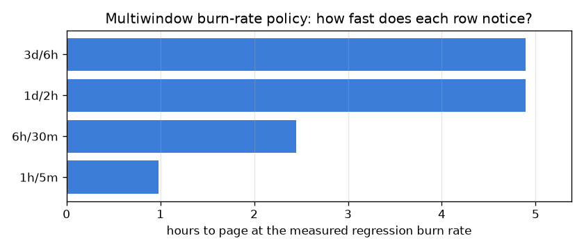

# NetSentry — Detection SLOs and Burn-Rate Alerting

_Synthetic stand-in. Replay of 24,957 temporal-split test flows in capture order at
the deployed operating point, at an assumed 41,667 flows/hour and a
30-day compliance period. Generated rules:
`docker/prometheus/slo_rules.yml`._

## Why this report exists

The alerting rules this repo shipped first are static thresholds — *page if the attack-flag rate
exceeds 50% for ten minutes*. They have two failure modes and both are bad: tight enough to
catch a real regression means paging on noise, and loose enough to stay quiet means a slow,
sustained degradation can spend the entire month's tolerance for false alarms without ever
tripping the wire. Neither setting encodes the thing an operator actually cares about, which is
not the instantaneous rate but **how much of the acceptable-badness budget is left**.

An SLO makes that explicit. The objective sets a budget; the **burn rate** — observed bad-event
rate divided by the rate that would exhaust the budget exactly at the end of the period — turns
every objective, however tight, onto one comparable scale. Burn rate 1 is on plan; burn rate
14.4 empties a 30-day budget in two days.

## Does the objective survive contact with the system?

**The specified objective fails before any incident happens, and that is the first finding.** A budget of 2.000% was written down; the healthy deployed model alerts on 2.312% of flows at its own operating point, a 1.16x burn *with nothing wrong*. Every downstream consequence follows mechanically: the slow rows page permanently, the fast rows can never be reached, and the on-call learns within a week that this alert means nothing. It is the most common way an SLO programme dies, and it is an arithmetic error rather than a judgement call — the objective was chosen from what someone wanted rather than from what the system does. The budget is therefore **calibrated** from the measured baseline with 2x headroom, to 4.624%, and everything below — including the generated rules — derives from that. The honest reading of the calibrated number is that it is a *starting* objective: it says the system may get twice as noisy as it is today before anyone is woken up, and tightening it is a decision about analyst capacity, which the [alert-queue study](alert_queue.md) prices.

## The three indicators, and which of them can actually be measured live

| SLI | definition | live? | objective | budget | observed | burn rate |
|---|---|---|---|---|---|---|
| alert ratio | alerts / scored flows | yes | 95.376% | 4.624% | 2.312% | 0.50x |
| false-alarm rate | alerts / confirmed-benign flows | retrospective | 99.000% | 1.000% | 0.059% | 0.06x |
| request success ratio | non-error responses / requests | yes | 99.900% | 0.100% | 0.050% | 0.50x |

The live SLI runs at 2.312% against a 4.624% budget — a 0.50x burn, meaning the month's tolerance for alerts is being spent 0.50 times faster than it is replenished. The retrospective one, which needs labels, sits at 0.059%. The gap between them is not an error: the alert ratio counts *every* alert, including the true ones, so it overstates the false-alarm rate by a factor of 39.3 at this prevalence. That is the correct direction for a live proxy to be wrong in — it is conservative — but it means the live SLO tightens automatically during a real incident, which is exactly when nobody wants to be paged about alert volume. The honest design is to keep both: page on the live one, review the retrospective one, and never claim the first is measuring the second.

## The burn-rate policy

Four rows, each pairing a long measurement window with a short confirmation window (Google SRE
Workbook, ch. 5). Requiring both is what makes the alert reset promptly once the problem stops,
rather than holding the page open for the length of the long window. The predicted columns are
closed form; the measured column replays the stream through the same rolling-window logic
Prometheus would apply, with the alert ratio stepped up 30x halfway
through — the shape of a bad deploy — and evaluation held back until each row's long window is
full, since a half-filled moving average manufactures pages a running deployment would never
see. The replayed capture is 16 hours of traffic, so any row whose long
window exceeds half of that is priced by the closed form only and marked accordingly.

| windows (long/short) | burn | severity | predicted time to page | budget spent at page | measured on replay | false pages when healthy |
|---|---|---|---|---|---|---|
| 1h/5m | 14.4x | page | 0.98 h | 2.0% | 0.96 h | 0 |
| 6h/30m | 6x | page | 2.45 h | 5.0% | 2.21 h | 0 |
| 1d/2h | 3x | ticket | 4.89 h | 10.0% | _out of replay reach_ | 0 |
| 3d/6h | 1x | ticket | 4.89 h | 10.0% | _out of replay reach_ | 0 |

A regression that lifts the alert ratio 30x — 2.312% to 68.042% — is caught by the 1h/5m row in 0.98 hours, with 2.0% of the period's budget already spent. The 1d/2h row would take 4.9 hours and 10.0% of the budget, which is why the slow rows are tickets rather than pages: their job is to catch erosion too gentle for the fast rows to see, not to be the primary detector. Within the replay's reach the measurement agrees with the closed form on 2 of 2 rows, and the healthy stream produces 0 false pages across the whole policy — the property that a static threshold cannot deliver, because it has no notion of how much tolerance has already been spent.

## How each row behaves across regression sizes

The point of a multiwindow policy is that different rows own different failure shapes. Priced
across a sweep of alert-ratio lifts, that division of labour is visible rather than asserted:
the fast rows stay silent until something breaks abruptly, and the slow rows are the only thing
standing between a gentle erosion and a fully spent budget.

| windows (long/short) | burn | severity | 1.5x regression | 3x regression | 10x regression | 50x regression |
|---|---|---|---|---|---|---|
| 1h/5m | 14.4x | page | never | never | never | 0.67 h |
| 6h/30m | 6x | page | never | never | never | 1.66 h |
| 1d/2h | 3x | ticket | never | never | 14.40 h | 3.33 h |
| 3d/6h | 1x | ticket | never | 48.00 h | 14.40 h | 3.33 h |

## The artefact

`docker/prometheus/slo_rules.yml` is generated, not hand-written, so the thresholds in the
alerting stack cannot drift away from the objective they were derived from. It contains one
recording rule per distinct window (so the burn expressions stay readable and the windows are
computed once) and one alert per policy row, evaluated against `netsentry_predictions_total` —
a metric the service already exports. A Prometheus already scraping this service loads it
unchanged.

## Scope

The compliance period is treated as a rolling window rather than a calendar month, which is the
simpler and slightly stricter reading. The replay converts Prometheus's *time* windows into
*event* windows through a fixed assumed flow rate; a real deployment's traffic is diurnal, so
the true window sizes breathe and the fast rows will be relatively slower overnight — an
argument for expressing the SLO on a ratio, as this one does, rather than on a count. The
false-alarm SLI is retrospective by construction, which is the same labelling constraint the
[metamorphic study](metamorphic.md) works around and the
[base-rate report](base_rate.md) prices: at production prevalence the alert ratio and the
false-alarm rate converge, and the gap shown here is a property of this split's unusually high
attack share. Budget policy — what to *do* when the budget is gone — is deliberately out of
scope; the [retrain-trigger study](retrain_policy.md) covers the model-side response and the
[promotion decision](promotion.md) covers the deploy-side one.