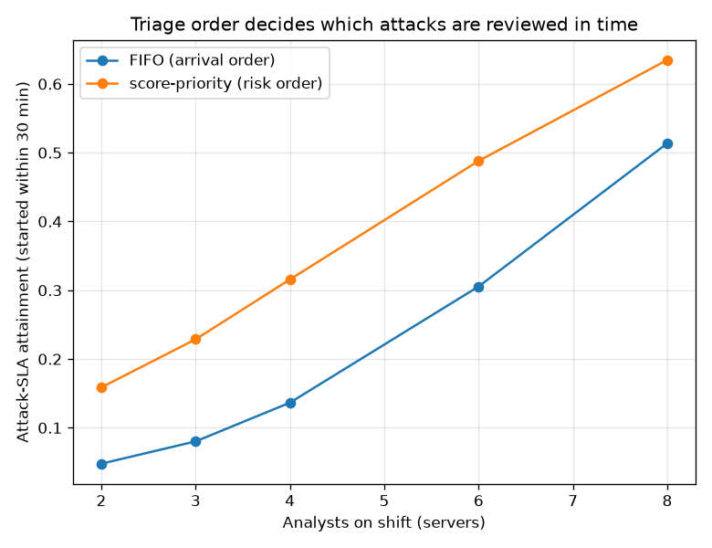

# NetSentry — SOC Queue Simulation (detection in the time domain)

_Synthetic stand-in. The deployed model's raw scores on the honest temporal test
split, thresholded at the primary 0.1% FPR
budget (validation-chosen); the 300 resulting alerts (293 true
attacks) are laid onto a 480-minute shift and worked by a
non-preemptive c-server queue. Each cell is the median of 20 seeded
arrival draws. The arrival timeline is a model (benign FPs uniform, attacks in
4 campaigns); the scores and labels are the model's real outputs._

## Why this report exists

The alert-queue study prices detection against an analyst *budget* — at K alerts
a day the ranking catches this fraction of attacks. That is capacity planning,
and it assumes every budgeted alert is worked. A real queue has **time**: alerts
arrive over the shift, analysts are finite servers, and a burst of benign false
positives can bury a genuine attack past the point anyone reviews it. Whether the
attack is seen in time depends on the triage discipline — the dimension a fraction
cannot express.

The queue is a non-preemptive M/G/c model with abandonment at the shift boundary.
The **attack-SLA attainment** — the share of true-attack alerts an analyst starts
working within the 30-minute SLA — decomposes the alert-queue
study's "detected" into "detected **and** triaged in time."

## FIFO — work the oldest ticket

| analysts | offered load (rho) | attack-SLA | attack backlog | mean wait | p95 wait | utilization |
|---|---|---|---|---|---|---|
| 2 | 2.54 | 4.8% | 62.6% | 130.7 min | 264.7 min | 88% |
| 3 | 1.69 | 8.0% | 43.9% | 113.8 min | 225.6 min | 86% |
| 4 | 1.27 | 13.7% | 30.0% | 85.5 min | 199.0 min | 81% |
| 6 | 0.85 | 30.5% | 16.2% | 46.0 min | 106.6 min | 70% |
| 8 | 0.63 | 51.4% | 6.8% | 25.7 min | 59.8 min | 56% |

## Score-priority — work the highest-risk ticket

| analysts | offered load (rho) | attack-SLA | attack backlog | mean wait | p95 wait | utilization |
|---|---|---|---|---|---|---|
| 2 | 2.54 | 15.9% | 66.4% | 63.2 min | 220.7 min | 88% |
| 3 | 1.69 | 22.9% | 50.2% | 59.8 min | 210.8 min | 86% |
| 4 | 1.27 | 31.6% | 35.7% | 55.6 min | 192.6 min | 80% |
| 6 | 0.85 | 48.8% | 15.2% | 41.5 min | 143.8 min | 69% |
| 8 | 0.63 | 63.5% | 4.1% | 23.3 min | 100.7 min | 56% |

## Read

**Triage order is worth up to 18 points of attack-SLA**, and the sweep shows exactly where: at 6 analysts (offered load rho=0.85) score-priority reviews 49% of attack alerts within the 30-minute window against FIFO's 31%. The queue is the same length under both disciplines — what changes is *which* tickets are at the front when the shift ends, and a risk-ranked queue puts the real attacks there.

The load column is the tell. Below rho of 1 (8 analysts) both disciplines clear the queue and SLA is easy; at and above it (2, 3, 4 analysts) the server-minutes cannot absorb the demand, backlog accrues, and the discipline is all that separates a reviewed attack from one still in the queue at clock-out. This is the knee the alert-queue study's fraction cannot show, because a fraction assumes the queue was worked.

## Method & limits

- **Queue:** non-preemptive, 5 identical-server settings;
  service times exponential about 8 min; a ticket in
  service is never bumped (priority reorders only the *waiting* room).
- **Timeline is a model.** CIC-IDS2017 has no usable per-flow wall-clock, so
  arrivals are synthesized: benign false positives uniform over the shift, attack
  alerts clustered into campaigns (the correlated shape that makes ordering
  matter). The scores and labels flowing through it are the model's real outputs
  on the honest split — the queue dynamics are simulated, the detector is not.
- **Abandonment is the shift boundary**, not analyst give-up behaviour; a real
  SOC also has escalation, shift handover, and alert de-duplication this omits.
- Score-priority assumes the score *ranks risk*, which the calibration and
  importance-stability reports argue it does at the head of the distribution —
  the same premise the alert-queue lift rests on.
