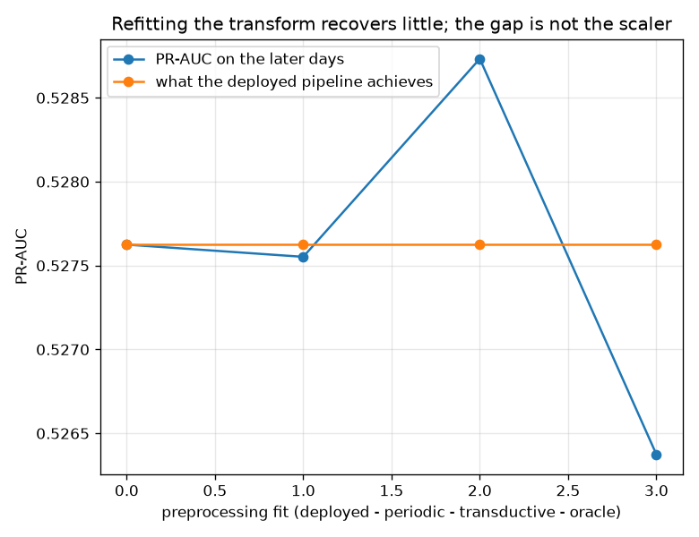

# NetSentry -- What Does a Train-Era Scaler Cost?

_Four preprocessing fits, each judged by training on 28,034 training flows and scoring 24,957 later-day ones at the 1.0% operating point. Regenerate with `netsentry staleness`._

## Why this report exists

`.claude/rules/ml.md` is categorical and correct: *never compute a mean, std, min, max or category list over the full dataset*. Every pipeline here obeys it.

Obeying it has a price nobody had measured. The imputer's medians and the scaler's constants are **training-day statistics applied unchanged to later-day traffic**. That is not leakage -- it is staleness, and it is a different problem with a different fix.

**Stale preprocessing is not what the temporal gap is made of, and the ordering of the arms proves it rather than merely suggesting it.**

The deployed pipeline carries 228 learned constants from the training days into traffic from later ones, and 11 of them have moved by more than a quarter of their own value. So the statistics really are stale. But every arm here lands within **0.0024** PR-AUC of every other, against a minimum detectable difference of 0.0168 -- and the **oracle arm, which cheats by fitting on exactly the distribution being judged, comes last** at 0.5264 against the deployed pipeline's 0.5276.

That ordering is the argument. If preprocessing were load-bearing, the arm with the most information about the evaluation distribution would win. It does not, so the differences between the arms are noise and the quantity does not matter here.

**And there is a mechanism, not just a measurement.** A gradient-boosted tree is invariant to any monotone rescaling of a feature: centring and scaling move the split points exactly as much as they move the data, so the tree finds the same partition either way. The scaler is, for this model class, close to decorative. The imputer is not -- substituting a different constant for a missing value genuinely moves a row -- but only 2.5% of later-day flows have a missing value to substitute, which bounds the whole effect from the other direction.

So the honest reading of the +0.0011 that refitting buys is: nothing, for a reason. The temporal gap is the later days containing attack classes the model never trained on, which is what the [covariate-shift study](covariate_shift.md) concluded by a different route when importance weighting made things worse. Two instruments, one answer -- **this is concept drift, and preprocessing is not where to spend effort on it.**

That is worth knowing in the useful direction too: the leakage rule that forbids fitting transformers outside the training split is **free** on this model. It would not be on a linear model or a neural network, where the scaler is load-bearing rather than decorative, and a project switching model classes should re-run this before assuming the rule stays costless.

## The four fits

| preprocessing fitted on | what it models | allowed? | PR-AUC | vs deployed | detection @ 1.0% | realised FPR |
|---|---|---|---|---|---|---|
| the deployed pipeline | statistics from the training days, applied unchanged | yes | 0.5276 | -- | 20.7% | 0.82% |
| periodic refit (first 20% of the later days) | recompute on a slice of unlabelled production traffic, as a scheduled job would | yes | 0.5276 | -0.0001 | 21.2% | 0.91% |
| transductive (all later-day features) | recompute on every unlabelled flow the detector will be asked about | yes | 0.5287 | +0.0011 | 20.5% | 0.75% |
| oracle (fit on the later days alone) | statistics from exactly the distribution being judged -- an upper bound | **no -- upper bound only** | 0.5264 | -0.0013 | 20.9% | 0.92% |

**The model is trained on the training split in every arm.** Only the transformer's constants change, which is what isolates preprocessing from everything else -- an arm that also retrained would be measuring two things at once and could not attribute either.

The **periodic refit** row is the one an operator would actually run: recompute the statistics on the first 4,991 flows of the new period, as a scheduled job, and carry them until the next run. It needs no labels, so it is not a retrain -- it is the cheapest possible response to drift, and its row says whether that response is worth scheduling.

The **oracle** row fits on the later days alone and is not deployable: knowing which flows will be judged is knowing something an operator does not know in advance. It bounds the others rather than competing with them.

## Which constants moved

| feature | statistic | training days | later days | movement |
|---|---|---|---|---|
| `Total Backward Packets` | scale | 22.81 | 58.43 | **+156%** |
| `SYN Flag Count` | scale | 2.682 | 4.881 | **+82%** |
| `Total Fwd Packets` | scale | 59.42 | 21.64 | **-64%** |
| `Total Backward Packets` | centre | 16.56 | 26.04 | **+57%** |
| `Total Fwd Packets` | centre | 26.73 | 15.28 | **-43%** |
| `Flow Duration` | scale | 3.648e+05 | 2.091e+05 | **-43%** |
| `SYN Flag Count` | centre | 1.784 | 2.472 | **+39%** |
| `Flow Packets/s` | scale | 689.4 | 915.3 | **+33%** |
| `Flow IAT Mean` | scale | 3.038e+04 | 2.071e+04 | **-32%** |
| `Flow Duration` | centre | 1.992e+05 | 1.437e+05 | **-28%** |
| `Total Fwd Packets` | impute | 11.98 | 8.842 | **-26%** |
| `Flow Duration` | impute | 1.03e+05 | 8.173e+04 | **-21%** |

These are the numbers the deployed transform is applying: a centre that has moved means every flow in that column is shifted by a constant describing traffic that no longer exists, and a moved scale means the column reaches the model with the wrong variance. The drift is real.

**Whether it matters is a separate question, and the table above answers it: no.** Keeping the two apart is the discipline -- a large movement in a statistic the model is invariant to costs exactly nothing, and reporting the movement as though it were a cost is how a monitoring dashboard ends up full of alarms nobody acts on.

## Scope and honest limits

- **This measures preprocessing, not retraining.** Every arm trains the same model on the same split. The question is what the *transform* being out of date costs, which is a strictly smaller question than what the model being out of date costs.
- **Transduction is legitimate here and is not always.** Recomputing statistics over flows the detector will be asked about assumes those flows are available in a batch. A strictly streaming deployment sees each flow once and would need the periodic-refit row instead, which is why it is measured separately.
- **The oracle arm leaks and is labelled as leaking.** It is reported because a decomposition needs an upper bound, and omitting it would leave the concept-drift share unmeasurable rather than unmeasured.
- **A moved statistic is not automatically a cost.** The drift table ranks constants by how far they moved, not by how much the model relies on them; the [importance-stability study](importance_stability.md) covers the second question.
- **One split, one model.** The decomposition is specific to this temporal boundary and this classifier. A tree ensemble is largely invariant to monotone rescaling in the first place, which is a plausible reason preprocessing matters as little as it does here and a reason to expect a different answer for a model that is not.
