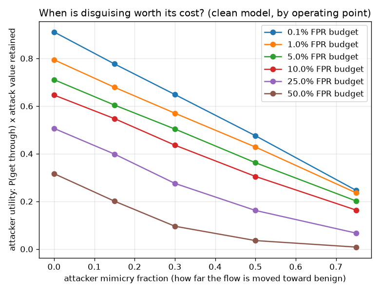

# NetSentry — The Arms Race as a Game: Strategic Equilibrium

_Synthetic stand-in. Honest temporal split. Attacker utility
`(1 - detection) * (1 - fraction)^1` — the chance of getting
through, times how much attack survives the disguise. Defences are the clean model plus
adversarial training at each mimicry level._

## Why this report exists

The [evasion study](robustness.md) measures a one-shot attack; the [hardening
study](hardening.md) answers it with one round of adversarial training and re-measures. Both stop
one move too early, because a real adversary sees the fix and moves again. Treating it as a game
makes three things computable: the attacker's **cost** (explicit, and not an L2 norm — a flow
that looks benign *is* less of an attack), the **arms race** (simulated rather than assumed), and
the value of **commitment** (a defender who moves first should not pick the model that is best
against today's attack).

It also forces a question the sequential studies never ask, which turns out to be the one worth
answering: **is this detector worth evading at all?**

## The payoff matrix at the deployed operating point

Detection for every defence against every attack, at the deployed 0.1%
false-alarm budget. Bold marks the attacker's utility-maximising reply to each defence.

| defence \ attack | 0% mimicry | 15% mimicry | 30% mimicry | 50% mimicry | 75% mimicry | attacker's best reply |
|---|---|---|---|---|---|---|
| clean (no hardening) | **8.9%** | 8.6% | 7.3% | 4.9% | 1.5% | 0% |
| hardened @ 0.15 | **8.0%** | 13.5% | 16.2% | 15.2% | 10.6% | 0% |
| hardened @ 0.3 | **8.8%** | 10.5% | 34.0% | 91.1% | 99.9% | 0% |
| hardened @ 0.5 | **10.6%** | 10.8% | 11.9% | 86.6% | 100.0% | 0% |

**At the deployed operating point, evading this detector is irrational.** The clean model catches 8.9% of undisguised attacks at the 0.1% false-alarm budget, so an attacker who does *nothing* already gets 91% of their traffic through with the attack fully intact. Every disguise on offer costs more attack value than it buys in evasion, so the utility-maximising move is the empty one — and the bold cells above sit in the leftmost column for every defence. This is not a quirk of the utility function; it is arithmetic. Mimicry at fraction `f` only pays when it cuts detection by more than roughly `f`, and a detector at 8.9% does not have that much to give away in total. The adversarial-ML literature on evasion implicitly assumes a detector worth evading, and the honest reading of this table is that **the deployed operating point is not one**: the adversary's rational strategy against it is to ignore it.

## How good must a detector be before it is worth evading?

The same defences and the same attacks, re-thresholded across operating points. Only the
threshold changes, so this isolates the effect of detection strength on the adversary's
incentive to adapt.

| FPR budget | clean-model detection | attacker's best reply | detection at that reply | is disguising worth it? |
|---|---|---|---|---|
| 0.1% (deployed) | 8.9% | 0% mimicry | 8.9% | no |
| 1.0% | 20.6% | 0% mimicry | 20.6% | no |
| 5.0% | 28.9% | 0% mimicry | 28.9% | no |
| 10.0% | 35.4% | 0% mimicry | 35.4% | no |
| 25.0% | 49.4% | 0% mimicry | 49.4% | no |
| 50.0% | 68.3% | 0% mimicry | 68.3% | no |

**No operating point in the sweep makes evasion worthwhile.** Even where the detector catches 68.3% of attacks, doing nothing still beats every disguise on offer. That bounds the whole adversarial programme here: on this feature set and this model, the attacker's dominant strategy is to leave the traffic alone, and defensive effort is better spent raising detection than anticipating evasion.

## How sensitive is that to what the disguise costs?

The result above rests entirely on the attacker's cost model, so the assumption is swept rather
than defended. A smaller exponent `k` means the attack retains more of its value while disguised
— a cheaper disguise, and a more capable adversary.

| disguise cost exponent `k` | best reply at 0.1% FPR | best reply at 50.0% FPR | does evasion ever pay? |
|---|---|---|---|
| 1 (as modelled) | 0% mimicry | 0% mimicry | no |
| 0.5 | 0% mimicry | 0% mimicry | no |
| 0.25 | 0% mimicry | 0% mimicry | no |
| 0.1 | 0% mimicry | 0% mimicry | no |
| 0.05 | 75% mimicry | 0% mimicry | **yes** |

Evasion becomes rational once the disguise is cheap enough — at `k = 0.05` and below, where a 15% disguise costs the attacker 1% of the attack's value rather than the 15% the linear model charges. That is the honest form of this report's headline: the claim is not *evasion never pays*, it is **evasion does not pay unless disguising is nearly free**, and the threshold at which it flips is a number rather than an opinion. Which side of it a real adversary sits on is a question about attack semantics — how much of a DoS survives having its inter-arrival times padded — that this dataset cannot answer, so it is stated as a condition instead. It also flips at the **deployed** 0.1% budget before the strongest 50.0% one, which is the reverse of the intuitive answer and worth stating: a disguise removes a larger *share* of a weak detector's already-small detection, so the marginal value of hiding is highest exactly where detection is lowest. The consolation is that the stakes are lowest there too — at 8.9% detection the attacker was already getting 91% of their traffic through without bothering to hide.

## The myopic arms race

Played at the deployed 0.1% budget — no operating point in the sweep makes evasion pay, so the game is degenerate everywhere and these are reported for completeness. Each round the attacker best-responds to what is deployed, and the defender
then adopts whatever is strongest against *that* attack. Neither looks ahead.

| round | deployed defence | attacker plays | detection |
|---|---|---|---|
| 1 | clean (no hardening) | 0% mimicry | 8.9% |
| 2 | hardened @ 0.5 | 0% mimicry | 10.6% |
| 3 | hardened @ 0.5 | 0% mimicry | 10.6% |
| 4 | hardened @ 0.5 | 0% mimicry | 10.6% |
| 5 | hardened @ 0.5 | 0% mimicry | 10.6% |
| 6 | hardened @ 0.5 | 0% mimicry | 10.6% |

The race **converges**: after round 5 neither side changes, settling at 10.6% detection with the defender running *hardened @ 0.5* against 0% mimicry. Detection over the rounds runs 8.9% -> 10.6% -> 10.6% -> 10.6% -> 10.6% -> 10.6%. The swing between the best and worst round is 1.7% points, which is how much a defender who quotes the number from a *good* round is overstating what they have.

## Commitment: the Stackelberg solution

The defender who moves first and knows the attacker will re-optimise picks *hardened @ 0.5*, against which the best reply is 0% mimicry and detection holds at **10.6%**. Commitment is worth essentially nothing here: the myopic race ends at 10.6%. Where the two differ, it is because the myopic defender optimises against the attack in front of them, which is a different objective from optimising against the attack that will *follow* their choice. Measured on the attacker's own terms, the equilibrium strips **2%** of the value they extract from an undefended detector — the honest way to state a defence's worth, since the attacker's payoff is the thing a defence exists to reduce.

## Is there an equilibrium at all?

The matrix has 1 pure-strategy equilibrium (cell): *hardened @ 0.5* vs 0% mimicry. Neither side gains by moving unilaterally, so this is where a patient adversary and a patient defender end up regardless of who moves first — and it is the only detection figure in this repo that carries that property.

## Scope

The defender's strategy set is finite and small — the clean model plus adversarial training at a
handful of mimicry levels — so this is a *game over deployable configurations*, not over all
possible detectors, and the equilibrium is an equilibrium of that restricted game. The attacker's
effectiveness decay is a modelling choice: linear in the mimicry fraction, defensible for
volumetric attacks and probably too generous for a slow-and-low one, so the exponent is a config
knob. It is also the assumption the headline is most sensitive to — a cheaper disguise moves the
frontier down — which is exactly why the frontier is reported as a threshold rather than as a
verdict. Attacks move in the same controllable-feature set the [evasion](robustness.md) and
[verification](verify_trees.md) studies use, so the three cannot drift apart. The structural
alternative is the [monotone-constraint](monotonic.md) model, which does not play this game at
all: it makes the inflation family impossible by construction rather than expensive, which is why
a constraint that costs nothing beats a defence that has to be re-derived every round.