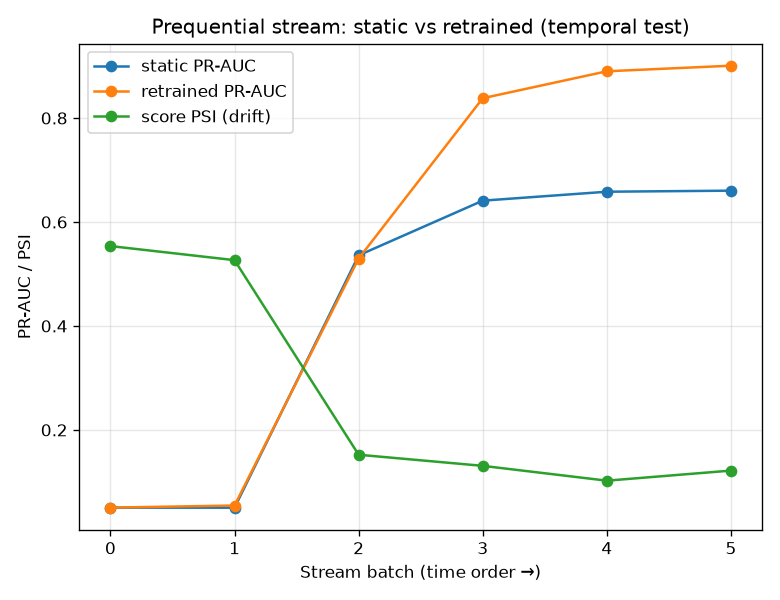

# NetSentry — Prequential Streaming (drift → retrain)

_Synthetic stand-in. The temporal **test** (later-day) flows replayed as
6 time-ordered batches, scored prequentially (score, then learn). One
operating threshold (1%-FPR, raw score 0.867) is fixed
across the stream, so model freshness is the only variable. Score PSI is measured
against the training-score reference (the drift monitor's signal)._

## From measuring drift to acting on it

`netsentry drift` shows later-day traffic moves; this asks the operational
follow-on — does retraining recover what drift costs? A **static** model (frozen at
deploy) is compared against one **retrained** on each labeled batch as it arrives.
The gap is the value of continuous learning; the cost is the labels the retrain
needs, which is exactly the analyst budget the active-learning study prices.

| batch | flows | attacks | score PSI | static PR-AUC | retrained PR-AUC |
|---|---|---|---|---|---|
| 0 | 4,160 | 156 | 0.554 (major) | 0.051 | 0.051 |
| 1 | 4,160 | 131 | 0.527 (major) | 0.050 | 0.055 |
| 2 | 4,160 | 1,104 | 0.152 (moderate) | 0.536 | 0.530 |
| 3 | 4,159 | 1,614 | 0.131 (moderate) | 0.641 | 0.838 |
| 4 | 4,159 | 1,615 | 0.102 (moderate) | 0.658 | 0.890 |
| 5 | 4,159 | 1,617 | 0.122 (moderate) | 0.660 | 0.901 |

## Read

Retraining pays off: mean batch PR-AUC rises from **0.433** (static) to **0.544** (retrained) across the stream. The static model, frozen on Mon-Wed, cannot recall the later-day attack types it never trained on; the retrained model recovers once it has seen labeled examples of them. Score PSI climbs to 0.55 over the stream, so the batches where the static model slips are the same ones the drift monitor would have flagged - measurement and failure coincide.

The loop this closes: **drift monitor** (PSI rises) → **trigger** (a major-PSI batch
is the retrain signal, the same threshold the Prometheus drift alert uses) →
**retrain** (fold in recent labels) → **recover**. It also re-states the project's
spine — the temporal shift is real and measurable — from the production-lifecycle
angle rather than the single-split one.
