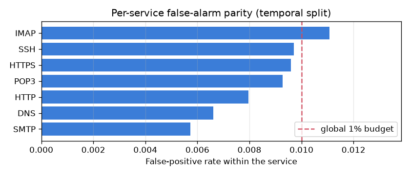

# NetSentry — Per-Service Detection Parity

_Synthetic stand-in. Honest **temporal** test flows grouped by the service implied by
`Destination Port`, scored at one global 1%-FPR threshold (raw
attack score 0.867, chosen on validation). Overall at this cut: detection
21.0%, FPR 0.88%. Services with fewer than
100 flows are omitted. FPR parity gap **0.53 pts**; detection
parity gap **42 pts**._

## Why slice by service, and why the port is safe to use here

A SOC routes and triages alerts by **service/asset**, not by attack class (which is
unknown when the alert fires). So the operational question is not only "which attacks
do we catch" (see the per-class slices) but "does one global threshold treat each
service fairly" — equal detection where attacks exist, and comparable false-alarm
pressure everywhere else. This is an equalized-odds audit in security clothing.

Crucially the grouping key, `Destination Port`, is a field the **model never sees**:
it is dropped from the feature set precisely so the model cannot memorise
"attack X always hits port Y" (`.claude/rules/ml.md`). Here the port only *labels the
slice*; it never enters a prediction. So every gap below is the model's behavioural
generalisation across services, not a port lookup leaking back in.

| service (dst port) | benign | attack | detection [95% CI] | FPR [95% CI] | alert share |
|---|---|---|---|---|---|
| IMAP | 4,066 | 0 | — (no attacks) | 1.11% [0.83, 1.48] | 27% |
| SSH | 2,164 | 0 | — (no attacks) | 0.97% [0.64, 1.48] | 13% |
| HTTPS | 2,084 | 0 | — (no attacks) | 0.96% [0.62, 1.48] | 12% |
| POP3 | 2,049 | 0 | — (no attacks) | 0.93% [0.59, 1.44] | 12% |
| HTTP | 4,148 | 3,081 | 42.1% [40.4, 43.9] | 0.80% [0.57, 1.12] | 20% |
| DNS | 2,118 | 0 | — (no attacks) | 0.66% [0.39, 1.11] | 9% |
| SMTP | 2,091 | 0 | — (no attacks) | 0.57% [0.33, 1.00] | 7% |
| other/ephemeral | 0 | 3,156 | 0.3% [0.2, 0.6] | — | 0% |

## Read

At the single global 1%-FPR threshold the overall test false-positive rate is 0.88%, but nothing pins any *single* service to that budget — the threshold only constrains the aggregate. **IMAP** runs hottest at 1.11% FPR and alone accounts for 27% of every false positive raised (though its interval still straddles the budget — at ~4,066 benign flows per service much of this spread is binomial noise, which is why the table carries Wilson intervals instead of bare rates), while **SMTP** sits at 0.57%. A SOC routing alerts per service watches the IMAP queue fill fastest either way; per-service thresholds would pin each queue to its own budget, which one global cut structurally cannot.

Detection is uneven too: **HTTP** catches 42% of its attacks against **other/ephemeral** at 0% (a 42-point gap, and their intervals do not overlap — this gap is signal, not sampling noise). The under-detected service is where the benign-only anomaly detector earns its place — the supervised model cannot recall an attack type concentrated on a service whose later-day traffic it never trained on.

The lesson mirrors the project's spine: just as the aggregate PR-AUC hides which
attacks are caught, a single global threshold hides *where* its false positives
concentrate. The honest move is to report the per-service spread and let the operator
set per-service operating points — the same "one number lies" discipline the temporal
split applies to the headline metric.
