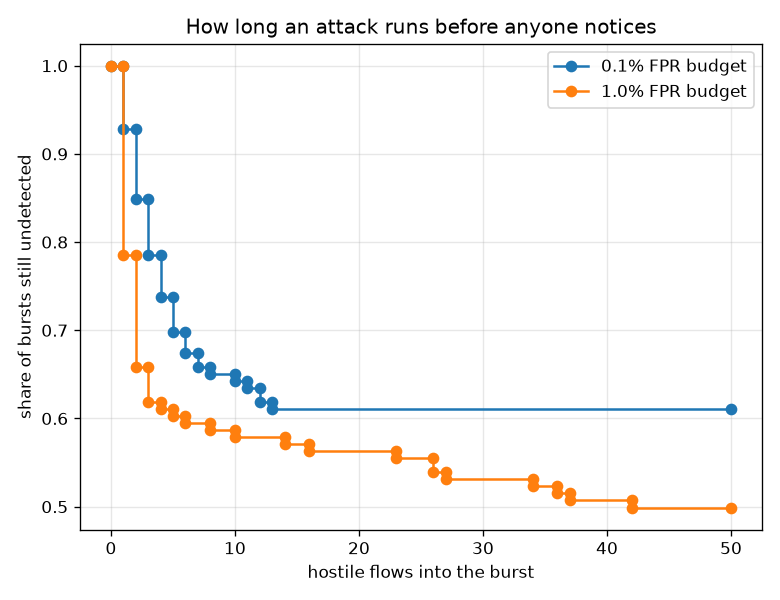
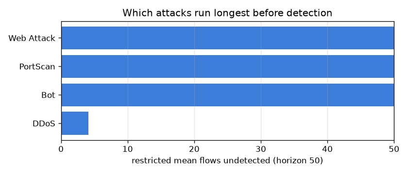

# NetSentry — Time to Detection, With the Misses Still Counted

_Synthetic stand-in. Honest temporal/binary split. Attack flows are chopped into
50-flow bursts within each (day, class) stream, giving 126
bursts; a burst's time is the position of its first alerting flow, and a burst that never
alerts is right-censored at the end of its window._

## Why this report exists

The [campaign study](campaigns.md) reports how many hostile flows slip past before an attack
raises its first alert, over the campaigns that raised one. Those are the only campaigns with a
latency to average — and that is the exact shape of survivorship bias. The campaigns that never
alerted are not missing data; they are the worst outcomes in the sample.

Right-censoring is the standard name for this and the Kaplan-Meier estimator (1958) is the
standard fix. A burst that ran 50 flows without detection is not discarded:
it is evidence that detection takes longer than 50 flows, and it counts in
the at-risk denominator for every moment it was observed.

```
S(t) = product over detection times t_i <= t of ( 1 - d_i / n_i )
```

Nothing is imputed, nothing is dropped, and the curve is what an operator actually wants: the
probability that an attack is still running unnoticed after `t` of its flows.

## The bias, measured

| FP budget | threshold | bursts detected | naive mean over detected | Kaplan-Meier median | restricted mean |
|---|---|---|---|---|---|
| 0.1% | 0.98780 | 38.9% | 4.1 flows | **> 50 (never reached)** | 32.1 flows |
| 1.0% | 0.86717 | 50.0% | 6.2 flows | **42** | 28.1 flows |

At the 0.1% budget the naive figure — mean first-alert position over the bursts that alerted — is **4.1 flows**, and it is a number about a detector nobody deployed. It conditions on success. Meanwhile the Kaplan-Meier median does not exist — the curve never falls to one half, because only 38.9% of bursts are ever detected at all, and the restricted mean over a 50-flow horizon is **32.1 flows**, +28.1 against the naive one. The gap is not noise, it is the 61% of bursts the naive average silently deleted — and it deleted precisely the worst ones. Reporting mean time-to-detection over detected incidents is the single most common way a detection metric flatters itself, and the correction has been standard in survival analysis since 1958.



## Does a looser budget catch attacks sooner?

Comparing the 0.1% and 1.0% operating points by log-rank — every burst counted, censored ones included — the difference is significant (chi-square 4.2, p = 0.041). Detection rises from 38.9% to 50.0% of bursts and the restricted mean moves from 32.1 to 28.1 flows, so the looser budget genuinely catches attacks earlier, and the extra false positives buy detection speed rather than merely detection volume.

## Which attacks run longest

| attack class | bursts | detected | Kaplan-Meier median | restricted mean |
|---|---|---|---|---|
| Bot | 7 | 0.0% | > 50 (never reached) | 50.0 flows |
| PortScan | 63 | 0.0% | > 50 (never reached) | 50.0 flows |
| Web Attack | 6 | 0.0% | > 50 (never reached) | 50.0 flows |
| DDoS | 49 | 100.0% | 3 | 4.1 flows |

**Time to detection is not a continuum here — it is a property of the attack class.** DDoS is detected in essentially every burst, at a median of 3 flows; Bot, PortScan, Web Attack are detected in none of them. Nothing sits in between. That reframes the aggregate curve above: its restricted mean of 32.1 flows is a **mixture artefact**, not a typical wait — no burst anywhere in this data actually takes that long to be caught, because bursts are either caught almost immediately or never. The operational consequence is direct. There is no latency to tune: shaving flows off the time-to-alert would buy nothing, because the classes that are seen are already seen at once. The entire quantity is governed by *which classes are visible at all*, which makes this a coverage problem and hands it to the [slices](slices.md) and [novelty](novelty.md) studies rather than to the threshold.



## Scope

Censoring here is **administrative**: every burst is followed for a fixed number of its own
flows and then stops, so whether a burst is censored is independent of how detectable it was.
That independence is the assumption Kaplan-Meier needs, and this design gets it by construction
rather than by argument — a design that stopped following a burst when the attack stopped would
violate it, because attacks that end quickly are not a random sample of attacks. Time is
measured in the burst's own hostile flows rather than in seconds, which is the right unit for a
flow-level detector and the only one available without per-flow timestamps; a wall-clock version
would additionally capture the fact that some attacks emit flows far faster than others. Bursts
within a (day, class) stream are not independent — they come from the same operation and share
whatever made it easy or hard to see — so the confidence intervals are narrower than they should
be, in the usual direction for clustered data. The horizon for the restricted mean is the burst
length itself, so it is a bounded summary of a bounded window and not an estimate of the true
mean time to detection, which is undefined whenever some attacks are never detected at all.