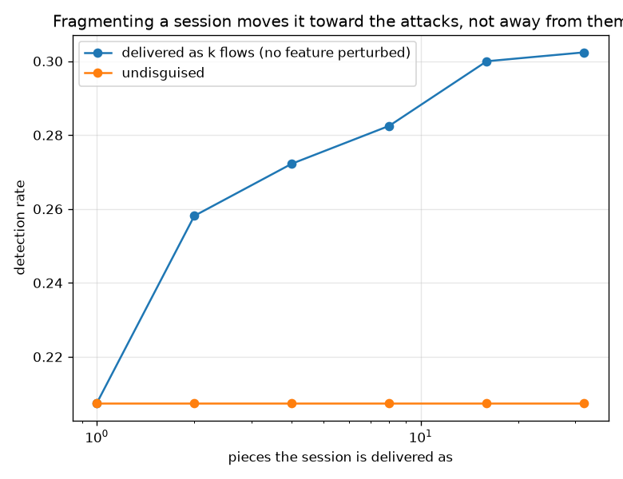

# NetSentry -- Which Features Can an Attacker Actually Change?

_All 77 feature columns classified by how CICFlowMeter computes them, the mimicry attack re-run under 4 threat models, and flow splitting measured at the 1.0% operating point. Regenerate with `netsentry threatmodel`._

## Why this report exists

The [evasion study](evasion.md), the [interval verifier](verify_trees.md) and the [universal perturbation](universal.md) share one list: `robustness.controllable_features`. Every robustness number this project publishes is conditional on that list being right, and it has never been derived from anything -- it was written once and inherited since.

Deriving it is not a matter of opinion. Each CIC feature is computed from packets by a stated procedure, and an attacker sending traffic *to* a service occupies one side of the conversation. They set their own packet sizes, inter-arrival times, flags and window sizes. They do not set the server's.

**The list every robustness number here depends on is wrong 24 ways out of 77, and correcting it in either direction makes the attacker worse off.**

`robustness.controllable_features` grants an adversary 39 of the 77 columns. Deriving each one from how CICFlowMeter computes it instead: **12 are over-claimed** -- backward-direction features measuring the *responder's* behaviour, which a client-side attacker cannot set without already owning the server -- and **12 are under-claimed**, forward features the attacker plainly can set that the list omits. It is not a subset or a superset of the honest answer. It is a different set.

**And the evasion result this project publishes depends on the over-claim.** Under the shipped list, centroid mimicry takes detection from 20.7% to 14.3%. Restricted to the forward direction -- everything the attacker physically sends, and nothing else -- the identical attack takes it to **23.8%**, which is *higher* than doing nothing at all.

That is not a rounding artefact, and the mechanism is worth stating. Moving only the forward half of a flow toward benign traffic produces a record that looks benign in one direction and like an attack in the other -- a combination that appears nowhere in the training data, and which a tree ensemble is free to score however the splits happen to fall. **Partial mimicry is not a weaker version of full mimicry; it is a different input.** The [transport study](transport.md) found the same shape from another angle: centroid mimicry aims at the worst target available.

The second half of the study is a capability the threat model does not mis-specify but **omits entirely**. Every attack in this repository perturbs the features of one flow; an attacker who delivers one session as 32 shorter ones perturbs nothing and changes only the accounting. A per-flow perturbation budget cannot represent that at all.

**And it backfires too.** Fragmenting into 32 pieces takes detection to **30.2%**, 46% *above* the undisguised attack, at an unchanged false-positive rate -- and the trend is monotone, so the best available split for the attacker is not to split at all.

The reason is specific and checkable rather than mysterious. The attacks in this dataset **are** short, low-volume flows -- scans, brute-force attempts, probes. Fragmenting a session divides its totals, which moves it *toward* that region rather than away from it. The folk intuition that splitting hides you assumes a detector keying on volume crossing a threshold; a model trained on scans keys on volume being **low**.

**Three results, and all three say the same thing: this threat model was written from intuition rather than derived from the data.** The published robustness numbers turn out to be pessimistic about this attacker, which is the safe direction to be wrong in -- but nobody had established that, and a threat model that is accidentally conservative is not a threat model.

## The audit

| class | features | what it means for a client-side attacker | claimed by the list |
|---|---|---|---|
| **forward** | 24 | computed only from packets the attacker sends, so directly settable | 12 of 24 |
| **joint** | 30 | computed from both directions, so movable but not to an arbitrary value | 15 of 30 |
| **backward** | 22 | computed only from the responder's packets, so not settable by a client at all | 12 of 22 |
| **environmental** | 1 | fixed by the target or the protocol rather than by either party | 0 of 1 |

The classification is read off the dataset's own naming, which is unusually honest about provenance: a column carrying `Fwd` is computed over forward packets, `Bwd` over backward ones, and one carrying neither is computed over the merged stream and is therefore joint. `Destination Port` is the single environmental column -- an attacker chooses who to talk to, but the port is a property of the service, and changing it means attacking something else.

### Over-claimed: granted to the attacker, not theirs to set

| feature | why not |
|---|---|
| `Total Backward Packets` | measures the responder's packets |
| `Total Length of Bwd Packets` | measures the responder's packets |
| `Bwd Packet Length Max` | measures the responder's packets |
| `Bwd Packet Length Min` | measures the responder's packets |
| `Bwd Packet Length Mean` | measures the responder's packets |
| `Bwd Packet Length Std` | measures the responder's packets |
| `Bwd IAT Total` | measures the responder's packets |
| `Bwd IAT Mean` | measures the responder's packets |
| `Bwd Packets/s` | measures the responder's packets |
| `Avg Bwd Segment Size` | measures the responder's packets |
| `Subflow Bwd Packets` | measures the responder's packets |
| `Subflow Bwd Bytes` | measures the responder's packets |

### Under-claimed: the attacker's to set, and the list omits them

| feature | why it is theirs |
|---|---|
| `Fwd IAT Std` | computed only from packets the attacker sends |
| `Fwd IAT Max` | computed only from packets the attacker sends |
| `Fwd IAT Min` | computed only from packets the attacker sends |
| `Fwd PSH Flags` | computed only from packets the attacker sends |
| `Fwd URG Flags` | computed only from packets the attacker sends |
| `Fwd Header Length` | computed only from packets the attacker sends |
| `Fwd Avg Bytes/Bulk` | computed only from packets the attacker sends |
| `Fwd Avg Packets/Bulk` | computed only from packets the attacker sends |
| `Fwd Avg Bulk Rate` | computed only from packets the attacker sends |
| `Init_Win_bytes_forward` | computed only from packets the attacker sends |
| `act_data_pkt_fwd` | computed only from packets the attacker sends |
| `min_seg_size_forward` | computed only from packets the attacker sends |

The under-claimed half is the direction that would matter if the errors did not cancel. An omitted forward feature is control the attacker has and the evaluation does not model, which makes a published robustness number optimistic. Here they happen not to help -- but *happening not to* is not a property anyone designed.

## What each threat model is worth

| threat model | features | detection after mimicry | vs no attack |
|---|---|---|---|
| the shipped list -- what `robustness.controllable_features` grants today | 39 | 14.3% | **-31%** |
| forward only -- packets the attacker sends, and nothing else | 24 | 23.8% | **+15%** |
| forward and joint -- everything a client-side attacker can move at all | 54 | 14.4% | **-31%** |
| every feature -- the unbounded attacker, as an upper bound rather than a threat | 77 | 15.7% | **-24%** |

Every arm runs the identical attack -- move each attack flow toward the benign centroid on the features that model allows -- against the identical threshold. Only the permitted set changes.

The **every feature** row is an upper bound rather than a threat: an attacker who can set all 77 columns is not evading a detector, they are writing its input. It is here because it bounds the others, and the fact that it does *not* dominate the shipped list is itself worth noticing -- more control is not monotonically more evasion when the attack is a fixed direction rather than a search.

## Flow splitting: the capability the budget cannot express

| session delivered as | detection | vs one flow | false-positive rate |
|---|---|---|---|
| one flow | 20.7% | **+0%** | 0.82% |
| 2 flows | 25.8% | **+24%** | 0.82% |
| 4 flows | 27.2% | **+31%** | 0.82% |
| 8 flows | 28.3% | **+36%** | 0.82% |
| 16 flows | 30.0% | **+45%** | 0.82% |
| 32 flows | 30.2% | **+46%** | 0.82% |

Nothing inside a flow is perturbed. What changes is the accounting: totals divide among the pieces while every rate and mean stays exactly what it was, because the same bytes over the same seconds is the same bytes per second however the flow table splits it. A threat model expressed as a per-flow perturbation budget cannot represent this at all -- from the detector's side no flow was perturbed, there are simply more of them.

Only the attacker's own sessions are fragmented, which is why the false-positive rate is identical in every row: splitting the benign traffic too would move both rates and stop the comparison being about the attack.

**Flag counts deliberately do not divide.** A split session is several TCP connections and each carries its own SYN and FIN, so a fragment shows roughly the whole session's flag counts rather than a share of them. Dividing them -- which the first version of this module did -- overstates how much splitting changes the feature vector.

## Scope and honest limits

- **The classification assumes the attacker is the client.** For an attacker who has compromised the server, the forward and backward columns swap roles and the shipped list becomes closer to right than the derived one. That is a different threat model and it is not the one this dataset's attacks occupy.
- **Joint features are treated as fully available in the 'forward and joint' arm**, which overstates that arm: an attacker moves a two-directional mean only partway, and how far depends on the responder. The honest bound sits between the forward-only and forward-and-joint rows.
- **Splitting is modelled at the feature level, not by re-running a flow assembler.** Each column is rescaled the way its own definition says it would move, and the extremes (`Max`, `Min`) are left unscaled although they would in fact shrink toward the mean -- so the effect measured here is understated rather than inflated.
- **The splitting result is about this dataset's attack mix.** Attacks here are dominated by short, low-volume flows, which is exactly why fragmenting moves toward them. Against a detector trained on high-volume exfiltration the same manoeuvre would plausibly work as the folklore says, and this study cannot speak to that case.
- **A backfiring attack is not a defence.** That mimicry and splitting both raise detection here says the specific manoeuvre is badly aimed, not that the model is robust. The [universal perturbation](universal.md) is the arm that does work, and it works by searching rather than by moving in a fixed direction.
