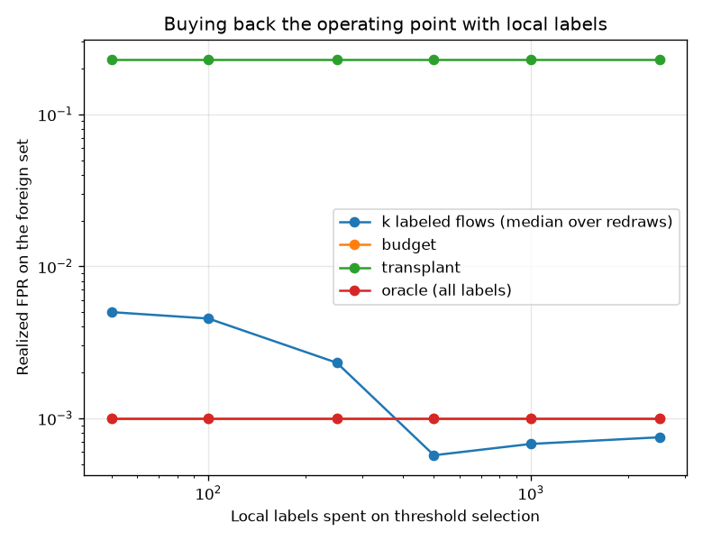

# NetSentry — Threshold Transfer (the operating point, re-bought locally)

_Synthetic stand-in. The deployed bundle's raw attack scores on the foreign
NetFlow-schema set; every policy targets the primary 0.1% FPR budget;
label-budget rows are medians over 30 seeded redraws. The foreign
set and its 30% attack mix are the cross-dataset study's stand-in —
the shape, not the magnitudes, is the finding._

## Why this report exists

The cross-dataset study ends with "the ranking transfers, the calibration does
not — re-choose thresholds on labeled local traffic," and the Zeek ingestion
docs repeat it. This report prices that sentence: what does each level of local
effort — none, unlabeled traffic, k labels, all labels — actually buy at the
operating point?

## The four policies

| policy | threshold | realized FPR | vs budget | detection (TPR) |
|---|---|---|---|---|
| transplant (source threshold, zero local effort) | 0.9769 | 23.0819% | 230.8x | 52.4% |
| quantile, unlabeled (as-is stream, 30% attack) | 1.0000 | 0.0285% | 0.3x | 0.3% |
| quantile, unlabeled (1%-attack stream) | 1.0000 | 0.0998% | 1.0x | 0.6% |
| oracle (all target labels) | 1.0000 | 0.0998% | 1.0x | 0.6% |

## Buying the budget back with labels

| labels | realized FPR (median) | IQR | budget held (within 2x) | detection (median) |
|---|---|---|---|---|
| 50 | 0.4991% | [0.0000%, 1.3477%] | 10% | 3.2% |
| 100 | 0.4528% | [0.0000%, 0.8878%] | 13% | 2.9% |
| 250 | 0.2317% | [0.1052%, 0.7273%] | 23% | 1.7% |
| 500 | 0.0570% | [0.0000%, 0.1676%] | 33% | 0.4% |
| 1,000 | 0.0677% | [0.0285%, 0.1640%] | 47% | 0.5% |
| 2,500 | 0.0749% | [0.0285%, 0.1337%] | 50% | 0.5% |

_Realized FPRs of exactly zero are plotted at the half-flow resolution floor;
the table carries the exact values._

## Read

**The transplanted threshold runs 231x over budget** (23.082% against 0.100%): the score distribution moved between schemas, so the source operating point floods the local queue — the cross-dataset caveat, realized as alert volume.

The unsupervised quantile is the tempting label-free fix, and the two rows show its operating envelope: on the as-is stream (30% attack) it realizes 0.0285% FPR at 0.3% detection — every attack in the stream pushes the quantile into the attack mass, so it under-alerts exactly when traffic is hostile — while on a production-like mix it lands at 0.0998% (0.6% detection). It is a prevalence assumption wearing a statistics costume, and it fails quietly in the direction of missed attacks.

**The budget is bought back with labels, and the price is visible:** 2,500 local labels hold the realized FPR within a factor of two in at least half the redraws, though no tested budget holds it in 80% of redraws — the IQR column is the warning against trusting one draw. Estimating a 0.1% quantile needs roughly 1,000 benign flows per expected false positive, which is why the small budgets scatter across orders of magnitude — the refresh study's small-window noise, met again at deployment.

## Method & limits

- Scores are the bundle's raw attack probabilities (the headline evaluation's
  scale); thresholds are compared on that one scale throughout.
- Label-budget redraws resample the same finite foreign set, so the spread is a
  bootstrap-flavored estimate of sampling noise, not fresh traffic.
- "Budget held" counts a redraw whose realized FPR is within a factor of
  2 of budget **on either side** — an over-strict
  threshold silently spends detection, which is a failure too, not a win.
- The foreign set is synthetic; on real UNSW-NB15 / NF-*-v2 data the transplant
  row is expected to be worse and the label curve slower. The commands are
  identical.
