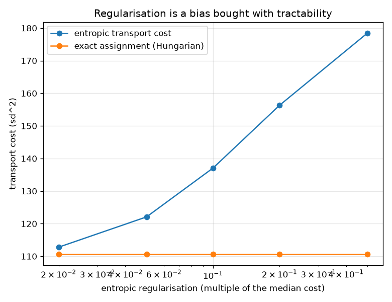
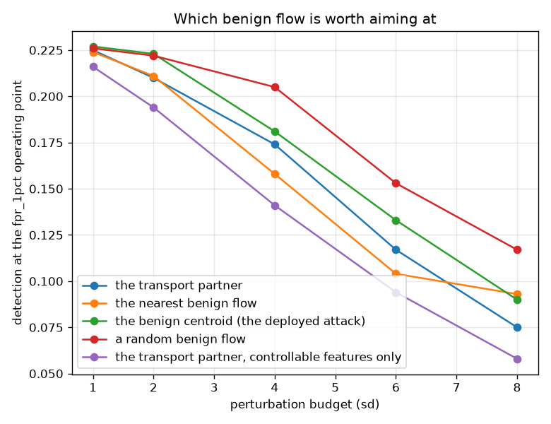
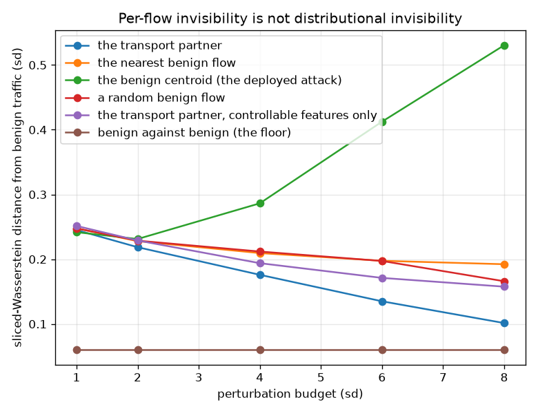

# NetSentry — Optimal Transport: the Distance, the Plan, and the Aggregate

_Exact optimal transport (Hungarian assignment) and its entropic approximation (Cuturi 2013)
on the temporal split's standardised feature space. 1,000 attack flows coupled to
1,000 benign ones, graded against a third, held-out benign sample. Distances are
in training standard deviations. Regenerate with `netsentry transport`._

## Why this report exists

Every drift instrument this project ships returns a scalar with no unit. PSI sums log ratios
over bins nobody picked operationally; KS reports a supremum CDF gap; [MMD](mmd.md) measures a
distance in a kernel space whose scale is a bandwidth heuristic. Each answers *did the traffic
move*. None answers *how far*, in a unit an engineer can act on, and none answers *where the
mass went*.

Optimal transport answers both, because it is not a statistic -- it is the solution to a
shipping problem. And the plan is what makes it more than another two-sample test: a coupling
between attack traffic and benign traffic is a **mimicry recipe**.

**The mimicry attack this repository already ships aims at the worst target available, and it is the only one a defender can see coming.** At a 8-sigma perturbation budget, moving every attack flow toward its optimal-transport partner takes detection from 22.4% to 7.5%; each flow's nearest benign neighbour reaches 9.3%, and the benign centroid -- the mimicry the [evasion study](robustness.md) runs -- leaves 9.0%, 20% more surviving detection than the transport plan for the identical budget. The best arm per flow is _the transport partner, controllable features only_; the quietest in aggregate is _the transport partner_.

The aggregate is where the arms genuinely separate. Judged as a *population* against held-out benign traffic -- the comparison a drift monitor makes -- the untouched attacks sit 0.278 sd away and benign traffic sits 0.061 from itself. Centroid mimicry ends at **0.533**, further from benign than the attack traffic was before anyone tried to hide it: collapsing every flow onto the mean builds a density spike where real traffic is diffuse, and it shows up at a worst-feature PSI of 5.6 in the monitor this project already runs. Nearest-neighbour mimicry stalls at 0.182 because it reuses 405 benign flows for 1,000 attacks and leaves the rest of the distribution empty. Only the transport plan reaches 0.102, and it is the only arm that can, because being a *coupling* is exactly the requirement that the disguised traffic still has the benign distribution.

Evasion therefore has two costs -- being individually unremarkable, and being collectively unremarkable -- and every attack in this repository until now paid only the first.

## Does this implementation compute optimal transport?

| check | reference | computed | gap |
|---|---|---|---|
| 1-D transport of a pure shift (closed form) | 1.7500 | 1.7500 | 0.00% |
| 1-D transport of a sample against itself (closed form) | 0.0000 | 0.0000 | 0.00% |
| Sinkhorn cost at reg = 0.02 x median vs the exact assignment | 110.6632 | 112.7935 | 1.93% |

At the sizes used here the *exact* problem is solvable: with equal sample sizes and uniform
weights, Birkhoff's theorem puts an optimal vertex of the transport polytope at a permutation,
so the Hungarian algorithm returns the true optimum in a fraction of a second. The entropic
solver therefore appears in this module as the thing being **graded**, not the thing being
trusted.

| regularisation | transport cost | excess over exact | iterations | distance to the centroid | distance to the exact partner |
|---|---|---|---|---|---|
| 0.5 x median | 178.49 | +61.3% | 200 | 0.58 | 7.50 |
| 0.2 x median | 156.33 | +41.3% | 300 | 1.71 | 6.74 |
| 0.1 x median | 137.08 | +23.9% | 300 | 2.99 | 5.90 |
| 0.05 x median | 122.09 | +10.3% | 300 | 4.38 | 4.89 |
| 0.02 x median | 112.79 | +1.9% | 300 | 5.92 | 3.43 |
| _none (exact assignment)_ | _110.66_ | _--_ | _--_ | _--_ | _0.00_ |

Two readings. Down the third column, entropic regularisation is a bias -- it smears the plan
and undercounts the cost -- and the bias shrinks as the parameter does, paid for in iterations.
Down the last two columns, the same parameter is a **dial between two known attacks**: at heavy
regularisation the barycentric map sits 0.58 sd from the benign
centroid, which is to say it *is* centroid mimicry; as the regularisation falls the map walks
away from the mean and toward the exact partner. Centroid mimicry and partner mimicry are two
ends of one dial, not two unrelated ideas, and nothing in the literature had to be taken on
faith to see it -- both endpoints are computed here.

One implementation detail is load-bearing: the scaling runs on **log-domain potentials**. The
textbook multiplicative form evaluates `exp(-cost / reg)` directly, and at the strengths that
give an accurate cost most of that matrix underflows to exactly zero, after which the solver
returns a confident answer about whichever entries survived.

## Drift, in units nobody has to calibrate

| feature | W1 (sd) | same-window floor | excess | PSI | KS | KS fires |
|---|---|---|---|---|---|---|
| `Total Backward Packets` | 0.415 | 0.015 | **0.400** | 0.033 | 0.065 | yes |
| `SYN Flag Count` | 0.256 | 0.017 | **0.239** | 0.024 | 0.055 | yes |
| `Total Fwd Packets` | 0.193 | 0.009 | **0.184** | 0.113 | 0.114 | yes |
| `Flow Duration` | 0.152 | 0.013 | **0.139** | 0.061 | 0.089 | yes |
| `Flow IAT Mean` | 0.059 | 0.017 | **0.042** | 0.002 | 0.014 | no |
| `Flow Packets/s` | 0.051 | 0.011 | **0.040** | 0.001 | 0.008 | no |
| `Flow IAT Max` | 0.045 | 0.019 | **0.026** | 0.002 | 0.013 | no |
| `Down/Up Ratio` | 0.033 | 0.015 | **0.018** | 0.001 | 0.011 | no |
| `Fwd Packet Length Min` | 0.023 | 0.010 | **0.014** | 0.001 | 0.013 | no |
| `Bwd Packet Length Mean` | 0.022 | 0.012 | **0.010** | 0.001 | 0.013 | no |

The `excess` column is the distance above a **floor**: the same transport distance computed
between two halves of the *training* window, which would be zero with infinite data and is not.
Reading the raw column instead credits every feature with its own sampling noise.

The three columns disagree, and the disagreement is the point.
`Total Backward Packets` has moved 0.400 sd -- a sentence an operator can act on -- while PSI puts the same feature at
0.033, a number whose only meaning is the folklore
banding (0.1 moderate, 0.25 major) that no property of this data supports. KS fires on 5
of 76 features under BH control at 5%, which across 25,000 flows is a statement
about the sample size as much as about the traffic.

The joint picture agrees and keeps the unit. The sliced-Wasserstein test averages the exact
one-dimensional cost over random projections, with the projections drawn **once** and reused
across every permutation -- re-drawing them per permutation would add projection noise to the
null that the observed statistic never paid, biasing the test toward accepting. It puts the
training window **0.089 sd** from the deployment window (p =
0.005 over 199 permutations), against
0.069 sd at p = 0.370 for two windows drawn
from training alone.

## The distance an attacker has to travel

The exact coupling puts the attack flows **10.52 standard deviations**
from the benign traffic they would have to blend into. The same computation between two
disjoint *benign* samples returns 8.43, so most of that figure is the
curse of dimensionality rather than the attack: in 76 dimensions the empirical
Wasserstein distance converges as `n^(-1/d)` and no affordable sample is unbiased. A transport
distance quoted without that floor is mostly a statement about the sample size, which is why
the floor is in the sentence.

Greedy nearest-neighbour matching reaches a mean cost of 88.9 against the
optimal assignment's 110.7 -- *cheaper*, and not a contradiction, because it
is not a transport plan at all. It sends 1,000 attacks onto
405 distinct benign flows and leaves the rest of the benign distribution
unoccupied. The constraint the assignment obeys and the greedy matching does not is precisely
the requirement that the disguised traffic still *has* the benign distribution.

## Racing the mimicry strategies at a matched budget

| target | 1 sd | 2 sd | 4 sd | 6 sd | 8 sd |
|---|---|---|---|---|---|
| the transport partner | 22.5% | 21.0% | 17.4% | 11.7% | 7.5% |
| the nearest benign flow | 22.4% | 21.1% | 15.8% | 10.4% | 9.3% |
| the benign centroid (the deployed attack) | 22.7% | 22.3% | 18.1% | 13.3% | 9.0% |
| a random benign flow | 22.6% | 22.2% | 20.5% | 15.3% | 11.7% |
| the transport partner, controllable features only | 21.6% | 19.4% | 14.1% | 9.4% | 5.8% |

Every arm moves each attack flow toward a target and stops at the same displacement budget, so
the comparison is about *which target is worth aiming at* rather than about how far the targets
happen to be. Detection starts at 22.4% on untouched flows, which is
the temporal split's honest operating point for attack families the model never trained on.

The four unconstrained arms are a two-by-two, and that is the reason there are four of them.
Two of them are **couplings** -- each benign flow is used exactly once, so following them all
the way reproduces the benign distribution -- and two are not. Two of them are **optimal** --
the total cost is the least any assignment could achieve -- and two are not.

| | a coupling | not a coupling |
|---|---|---|
| **optimal** | the transport partner | the nearest benign flow |
| **not optimal** | a random benign flow | the benign centroid |

Reading across the top row isolates the value of the *constraint*; reading down the first
column isolates the value of *optimality*. The random coupling is the instructive cell: it
satisfies the distributional constraint exactly as the transport plan does, and loses anyway,
because at a fixed budget a longer plan travels a smaller share of the way. Optimality is not
an aesthetic preference here -- it is how much of the disguise fits inside the budget.

## The cost the per-flow attacks never paid

| target | 1 sd | 2 sd | 4 sd | 6 sd | 8 sd |
|---|---|---|---|---|---|
| the transport partner | 0.245 | 0.219 | 0.176 | 0.135 | 0.101 |
| the nearest benign flow | 0.248 | 0.228 | 0.209 | 0.198 | 0.192 |
| the benign centroid (the deployed attack) | 0.242 | 0.231 | 0.286 | 0.412 | 0.531 |
| a random benign flow | 0.248 | 0.229 | 0.212 | 0.197 | 0.166 |
| the transport partner, controllable features only | 0.251 | 0.229 | 0.194 | 0.171 | 0.158 |
| _benign against benign (the floor)_ | _0.061_ | _0.061_ | _0.061_ | _0.061_ | _0.061_ |

This is the same experiment judged as a *population*, against a held-out benign sample the
targets were never drawn from -- which matters, because at full displacement the transport arm
reproduces its own target sample exactly and grading it there would measure a tautology.

| target | a coupling? | plan cost (sd^2) | distinct targets used | detection | distance from benign | vs the floor | worst-feature PSI |
|---|---|---|---|---|---|---|---|
| the transport partner | **yes** | 110.7 | 1,000 | 7.5% | 0.102 | 1.7x | 0.17 |
| the nearest benign flow | no | 88.9 | 405 | 9.3% | 0.182 | 3.0x | 0.23 |
| the benign centroid (the deployed attack) | no | 119.7 | 1 | 9.0% | 0.533 | 8.8x | 5.63 |
| a random benign flow | **yes** | 193.1 | 1,000 | 11.7% | 0.168 | 2.8x | 0.45 |
| the transport partner, controllable features only | no | 66.3 | 1,000 | 5.8% | 0.165 | 2.7x | 0.48 |

Every arm rejects the same-distribution null at the permutation test's resolution floor, which
is the right result to report and the wrong number to steer by: on a 1,000-flow
window, everything is significantly not-benign. **The distance is the operator's question, not
the p-value**, which is why the table carries the multiple of the same-population floor
instead.

The centroid arm goes the wrong way. Its worst-feature PSI reaches 5.63 against
the folklore "major shift" line of 0.25, so **the deployed drift monitor catches this attack
without being told it exists** -- and catches it more easily than it would have caught the
undisguised attack. That is a defensive finding hiding inside an attack study: a mimicry
adversary who ignores the aggregate hands the defender a signal in the one instrument the
defender already runs.

The last row is the realistic attacker, and it is the row that did not go as expected.
Restricting the displacement to the 39 features of 76 an
attacker can manipulate without breaking the attack -- and spending the whole budget inside
that subspace rather than across all of them -- leaves detection at 5.8% against the
unconstrained 7.5%. **The constrained attacker does better, not worse.** Every unit
of budget spent moving a field the exporter derives rather than the attacker sets is a unit the
model was not going to react to; the constraint concentrates the perturbation on the features
that carry the verdict.

What the constraint does cost is the second thing. 39 coordinates cannot
carry the attack distribution onto the benign one however they are spent, so the constrained
arm is not a coupling and its aggregate stalls at
2.7x the floor while
the unconstrained plan reaches
1.7x. **The two
costs of evasion come apart under a realistic threat model, and only the per-flow one is for
sale.** An attacker who can only pad and delay can become individually unremarkable and cannot
become collectively unremarkable, which is an argument for spending defensive effort on the
population rather than on the flow.

## Can transport close the temporal gap?

| arm | training rows | PR-AUC | detection @ 1% FPR |
|---|---|---|---|
| no adaptation (the deployed protocol) | 28,034 | 0.528 | 20.7% |
| separable OT map (every feature, every row) | 28,034 | 0.477 | 16.4% |
| subsample control (no map) | 1,200 | 0.498 | 16.2% |
| joint OT map (barycentric, subsample) | 1,200 | 0.468 | 11.3% |

The [covariate-shift study](covariate_shift.md) diagnosed the temporal gap as *concept* rather
than covariate shift and priced importance weighting -- the textbook fix -- at a loss. This is
the same question asked with the other textbook fix, and both maps here are estimated from
**unlabelled** deployment traffic, which a real deployment has.

The best transported arm (_separable OT map (every feature, every row)_, PR-AUC 0.477) does not reach the unadapted 0.528, and the winner over all four arms is _no adaptation (the deployed protocol)_. Transport moves the training features onto the deployment marginals as
advertised and the detector does not improve, because `p(y|x)` is what changed: the later days
carry attack families the earlier days never contained, and no map of `p(x)` can invent a
label relationship that was never in the training data. That is the third instrument to reach
the same verdict, which is worth more than the first one was.

## Scope and honest limits

- **The empirical Wasserstein distance is badly biased in high dimension.** Every distance here
  is reported against a same-population floor for that reason, and the floor is large:
  8.43 sd of the attack distance's 10.52. The
  *comparisons* between arms are unaffected -- they share a sample size and a witness -- but
  the absolute numbers are not distances between distributions, they are distances between
  samples.
- **The cost function is a modelling choice, not a fact.** Squared Euclidean distance on
  standardised features says every feature costs the same to change, which is false: an
  attacker pads packet lengths for free and cannot move a protocol flag at all. The
  controllable/uncontrollable split is a two-level approximation of a cost that is really
  per-feature, and a better one needs a threat model nobody has measured.
- **A displaced flow is not necessarily a valid flow.** A convex combination of two feature
  vectors can hold a fractional packet count or an inconsistent duration/rate triple. The
  unconstrained curve is an upper bound on what a feasible attacker achieves at the same
  budget, which is why the constrained arm is the operational number.
- **The attacker is assumed to know the benign distribution.** Sampling benign traffic is the
  cheapest thing on this list -- it is what a network gives away for free -- but the plan also
  needs the *feature space*, and that is the model-extraction problem the
  [extraction study](extraction.md) prices.
- **The aggregate test is offline.** A defender running it needs a window of the attacker's
  traffic, and an attacker who paces the campaign under the window keeps the fingerprint below
  the noise. What is measured here is that the fingerprint exists and that one attack strategy
  avoids it, not that a monitor would necessarily see it in time.
- **The adaptation map is transductive.** It is estimated from the deployment sample it is
  applied against; an online version has to re-estimate as traffic arrives, which is the
  [threshold-refresh](refresh.md) problem with more moving parts.