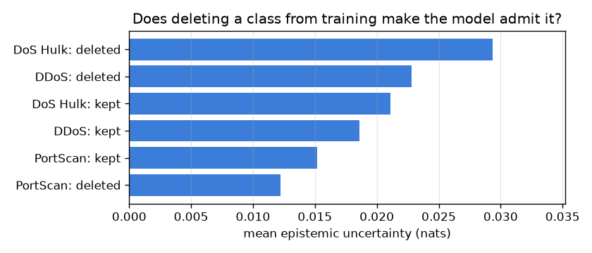
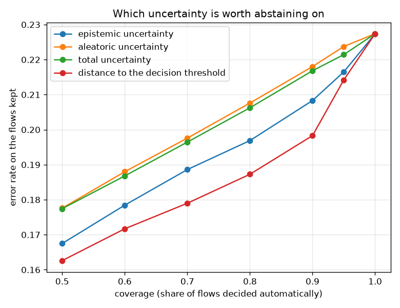

# NetSentry — Epistemic vs Aleatoric: Two Kinds of Not Knowing

_Synthetic stand-in. Uncertainty is decomposed over a 10-member bagged, re-seeded
ensemble of the deployed model — same hyperparameters, different bootstrap draws — and reported
in nats. The controlled arms run on the stratified split with DoS Hulk, PortScan, DDoS deleted from training in
turn; the abstention curves run on the deployed temporal split (24,957 test flows)._

## Why this report exists

The detector returns one number, and a low attack probability is asked to carry two very
different meanings. Sometimes it means *this looks genuinely benign*: the evidence is clear and
points that way. Sometimes it means *I have never seen anything like this*: the flow sits off
the edge of the training data and the number is a guess wearing a probability's clothes. A SOC
should treat those flows differently, and one score cannot tell them apart.

An ensemble can. For each flow, compare the entropy of the members' average opinion against the
average of their individual entropies:

```
total       = H(mean_m p_m)      the ensemble is unsure
aleatoric   = mean_m H(p_m)      ...and every member is individually unsure   (irreducible)
epistemic   = total - aleatoric  ...but each is confident and they disagree   (ignorance)
```

Aleatoric uncertainty is noise in the world and more data will not remove it. Epistemic
uncertainty is ignorance about the model and more data will. The difference is the mutual
information between the label and the choice of member (Houlsby et al. 2011; Depeweg et al.
2018), and it is non-negative by Jensen's inequality.

## First, an unexpected fact about the headline split

**Not one of the 5 attack classes on the test days appears in training.** The model trains on DoS GoldenEye, DoS Hulk, DoS Slowhttptest, DoS slowloris, FTP-Patator, Heartbleed, SSH-Patator and is tested on Bot, DDoS, Infiltration, PortScan, Web Attack — the sets are disjoint. That is worth pausing on, because it reframes the project's headline number: the temporal PR-AUC is not a measure of detecting known attacks slightly later, it is a measure of detecting **entirely unseen attack families** from behaviour alone. The honest number was always harder-won than it looked.

It also rules out the obvious experiment. With no shared classes there is no 'known attack' population on the test days to compare against, and any novel-vs-known contrast assembled across the day boundary would confound unfamiliarity with everything else that changed between Wednesday and Thursday. So the test below is run properly instead: on the **stratified** split, where every class appears on both sides, one attack class at a time is deleted from *training only* while the test set, the feature pipeline and the capture days are held fixed.

## The controlled test

One attack class is deleted from the training and validation folds; the test set is untouched.
If the decomposition means what it claims, epistemic uncertainty rises on the deleted class and
aleatoric does not.

| deleted class | flows | population | total | aleatoric | epistemic | epistemic share |
|---|---|---|---|---|---|---|
| DoS Hulk | 9,354 | benign | 0.2968 | 0.2831 | 0.0137 | 4.6% |
| DoS Hulk | 1,929 | attacks still in training | 0.3607 | 0.3396 | 0.0211 | 5.9% |
| DoS Hulk | 717 | **DoS Hulk (deleted from training)** | 0.4355 | 0.4062 | **0.0294** | 6.7% |
| PortScan | 9,354 | benign | 0.2539 | 0.2430 | 0.0110 | 4.3% |
| PortScan | 2,023 | attacks still in training | 0.2823 | 0.2671 | 0.0152 | 5.4% |
| PortScan | 623 | **PortScan (deleted from training)** | 0.2459 | 0.2337 | **0.0122** | 5.0% |
| DDoS | 9,354 | benign | 0.3004 | 0.2876 | 0.0128 | 4.3% |
| DDoS | 2,158 | attacks still in training | 0.3498 | 0.3312 | 0.0186 | 5.3% |
| DDoS | 488 | **DDoS (deleted from training)** | 0.3715 | 0.3487 | **0.0228** | 6.1% |

| deleted class | epistemic lift (should rise) | aleatoric lift (should not) | separation |
|---|---|---|---|
| DoS Hulk | **1.39x** | 1.20x | 1.16x (weak) |
| PortScan | **0.80x** | 0.87x | 0.92x (none) |
| DDoS | **1.23x** | 1.05x | 1.17x (weak) |

**The prediction holds only weakly.** Epistemic uncertainty rises 1.14x on the deleted class against an aleatoric rise of 1.04x — the right ordering, but not by enough to carry weight. Both terms moving nearly together is the signature of a population that is simply harder to classify rather than one that is specifically unfamiliar, and on this evidence the decomposition should not be leaned on as a novelty signal. The abstention section below is where it still earns its keep.



## Is it a novelty detector?

| deleted class | signal | uses labels | AUC vs benign (deleted class) | AUC vs benign (classes kept) |
|---|---|---|---|---|
| DoS Hulk | epistemic uncertainty | yes | **0.726** | 0.592 |
| DoS Hulk | aleatoric uncertainty | yes | **0.685** | 0.577 |
| DoS Hulk | attack score (the deployed signal) | yes | **0.908** | 0.857 |
| DoS Hulk | isolation forest (benign-only) | no | **0.816** | 0.653 |
| PortScan | epistemic uncertainty | yes | **0.526** | 0.505 |
| PortScan | aleatoric uncertainty | yes | **0.493** | 0.492 |
| PortScan | attack score (the deployed signal) | yes | **0.492** | 0.888 |
| PortScan | isolation forest (benign-only) | no | **0.537** | 0.747 |
| DDoS | epistemic uncertainty | yes | **0.629** | 0.570 |
| DDoS | aleatoric uncertainty | yes | **0.577** | 0.552 |
| DDoS | attack score (the deployed signal) | yes | **0.929** | 0.866 |
| DDoS | isolation forest (benign-only) | no | **0.847** | 0.664 |

Across the 3 arms, epistemic uncertainty beats the benign-only isolation forest on 0 of them at picking the deleted class out of benign traffic. The strongest signal on average is **attack score (the deployed signal)** (0.777 mean AUC). Two caveats keep this comparison honest in opposite directions: the ensemble saw labels and the isolation forest did not, so the ensemble has strictly more information; but the isolation forest was built for exactly this job while the ensemble's uncertainty is a by-product. The final column is the control — a signal that scores well on the classes still in training is measuring how conspicuous an attack is, not how unfamiliar, and only the gap between the two columns is evidence about novelty.

**The PortScan arm is the one to read.** With that class deleted, the detector scores it at 0.492 AUC against benign traffic — chance. It is completely blind to the attack. That is the exact situation a novelty signal exists to cover, and epistemic uncertainty reaches 0.526 on it: also chance. **The model is at chance on the attack and does not know it.** The isolation forest manages 0.537, barely better, so this is a hard case rather than a fair fight lost. On the other arms (DoS Hulk at 0.908, DDoS at 0.929) the detector still finds the deleted class perfectly well, because its sibling classes cover it — so those are precisely the arms where a novelty signal was not needed, and they are the arms where epistemic uncertainty looks best. The uncomfortable summary is that ensemble disagreement signals unfamiliarity most reliably where unfamiliarity costs least, and that is not a property worth deploying on. It is also a clean illustration of the underlying mechanism: a tree far from its training data does not abstain, it returns whichever leaf its last split routes to, and ten trees grown on overlapping bootstraps of the same features route it to the same place.

## Is it worth abstaining on?

| abstention signal | error at 90% coverage | area under the risk-coverage curve |
|---|---|---|
| distance to the decision threshold | 19.830% | 0.09320 |
| epistemic uncertainty | 20.832% | 0.09691 |
| total uncertainty | 21.682% | 0.10084 |
| aleatoric uncertainty | 21.802% | 0.10143 |

Handing the least-confident flows to a human is worth doing only if the signal picking them ranks the model's actual mistakes. **distance to the decision threshold** does it best here (error 19.830% at 90% coverage against 22.739% with no abstention), and **aleatoric uncertainty** worst. The decision rule is held fixed throughout — same scores, same threshold — so the curves compare abstention signals rather than smuggling in a threshold change. This is the same trade the [conformal](conformal.md) study makes with a coverage guarantee and the [multiplicity](multiplicity.md) study makes across a model family; the three abstain on different grounds — the data is ambiguous, the model family disagrees, this model is unsure — and an operator running all three would send a flow to review if any of them objected.



## The ensemble is not free

Averaging 10 members moves temporal test PR-AUC from 0.529 to
0.537 (+0.008), for 10x the training cost and
10x the inference cost. The decomposition, not the accuracy, is what the ensemble
is bought for here, and an operator who wants an abstention signal without that serving bill has
cheaper options this report will not pretend are equivalent: the [cascade](cascade.md) study
prices staged inference, and a single model's [conformal](conformal.md) prediction sets abstain
on ambiguity with no ensemble at all.

## Scope

Uncertainty is decomposed over a *bagged* ensemble, so it captures the variance from which
training rows were drawn and nothing else. It does not see uncertainty about the model family,
the feature pipeline, or the labels — [multiplicity](multiplicity.md) varies hyperparameters and
[leaderboard](leaderboard.md) varies families, and both find disagreement invisible here by
construction. The controlled arms delete one class at a time, which measures unfamiliarity with
*that* class against a model that still knows every other attack; deleting the whole attack side
would be a different and much easier question, and the benign-only [anomaly
detector](anomaly.md) already answers it. Class deletion also removes those rows from training,
so each arm's model is very slightly smaller — the effect is a fraction of a percent of the
training rows and cannot account for lifts of the size reported. All scores are raw
(uncalibrated) for consistency with the headline metrics.