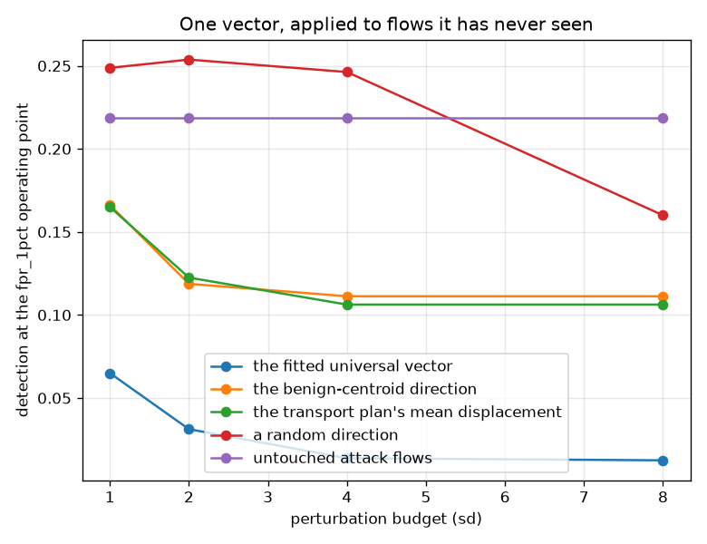
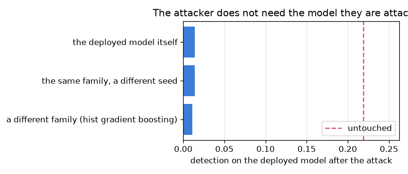

# NetSentry — One Perturbation, Shipped Once

_A single universal vector fitted by greedy coordinate descent on 400 attacker-held
flows and scored on 800 it has never seen, against three references at identical
L2 budgets, on the temporal split's fpr_1pct operating point. Regenerate with
`netsentry universal`._

## Why this report exists

Every evasion attack this project has measured is **per-flow**. Mimicry interpolates each flow
toward a benign reference; the query search optimises each flow against the model; the
[transport study](transport.md) couples each flow to its own benign partner. All of them need
the attacker to hold the target flow, and most need model access *at attack time* -- which is
exactly what a rate limit, an API key and a query-volume alarm are for.

A **universal adversarial perturbation** (Moosavi-Dezfooli et al., CVPR 2017) removes the
requirement. One vector, computed once, added to every future flow: no queries, no feedback, no
per-flow work. That converts an interactive attack into **a constant an attacker can ship**, and
there is nothing left in the request path to observe.

**One vector, fitted once on 400 attack flows, takes detection on 800 flows it has never seen from 21.9% to 1.4%** at a 4-sigma budget -- against 11.1% for the benign-centroid direction at the identical budget, and a random direction of the same norm that does not help at all.

There is essentially **no generalisation gap**: the vector performs on unseen flows exactly as it did on the ones it was fitted to. And it does not need the model. A vector fitted on a differently-seeded model of the same family reaches 1.4% on the deployed one, and one fitted on a *different family* reaches 1.1%. Rate limits, API keys and query-volume alarms defend against an attacker who has to ask; this attacker asks a model the defender does not control, once, offline.

Then the two things that make it much less alarming than the paragraph above, and both are measured rather than hoped for.

**The vector asks the attacker to send less.** 7 of the 8 largest coordinates are *negative* -- fewer bytes per second, smaller packets, fewer forward packets. An attacker can always add traffic and cannot always remove it, because what is being removed is the attack. Restricted to additions only, the same procedure takes just 2.7% off the deployed model.

**And against that feasible attacker the defence is already built and free.** A model constrained non-decreasing in every inflatable feature loses 0.0 points -- nothing at all, because additions cannot lower a non-decreasing score -- for a clean PR-AUC of 0.774 against 0.779.

## Does one vector generalise?

| direction | 1 sd | 2 sd | 4 sd | 8 sd |
|---|---|---|---|---|
| the fitted universal vector | 6.5% | 3.1% | 1.4% | 1.2% |
| the benign-centroid direction | 16.6% | 11.9% | 11.1% | 11.1% |
| the transport plan's mean displacement | 16.5% | 12.2% | 10.6% | 10.6% |
| a random direction | 24.9% | 25.4% | 24.6% | 16.0% |
| _untouched attack flows_ | _21.9%_ | _21.9%_ | _21.9%_ | _21.9%_ |

Every direction is projected onto the same L2 ball and restricted to the same
39 of 76 features, so the comparison is about *where to
push* rather than how hard -- the matched-budget discipline the
[transport study](transport.md) uses for the same reason.

The random row is the one to read first: at these budgets a random push of the same size does
not help the attacker at all
(24.6% against an untouched
21.9%), which is what rules out "any large perturbation would do".
The centroid direction -- the obvious universal attack, and the one the deployed
[evasion study](robustness.md) uses per-flow -- does help, and the fitted vector beats it by a
factor of 8.1.

| budget | on the flows it was fitted on | on flows it has never seen | gap |
|---|---|---|---|
| 1 sd | 6.8% | 6.5% | -0.3% |
| 2 sd | 3.2% | 3.1% | -0.1% |
| 4 sd | 2.0% | 1.4% | -0.6% |
| 8 sd | 2.0% | 1.2% | -0.8% |

The gap column is the whole question. A vector that only worked on its own fitting set would be
a per-flow attack with extra steps; this one transfers to unseen flows with no loss, which is
what makes it a *shipped constant* rather than an optimisation.

## Does the attacker need the model?

| the vector was fitted on | detection on that model | detection on the **deployed** model | cosine with the white-box vector |
|---|---|---|---|
| the same family, a different seed | 1.6% | **1.4%** | +0.967 |
| a different family (hist gradient boosting) | 2.0% | **1.1%** | +0.552 |
| _the deployed model itself (white box)_ | _--_ | _1.4%_ | _+1.000_ |

This is the row that decides whether the threat is operational. The realistic attacker does not
have the deployed model; they have *a* model, trained on whatever they could gather. Fitting the
vector on a differently-seeded model of the same family produces something nearly identical
(cosine +0.97) and works just as well.
Fitting it on a *different family* produces a visibly different vector
(cosine +0.55) that still works.

The defensive consequence is uncomfortable and worth stating plainly: **query-side defences do
not apply**. The attacker's queries go to their own surrogate, offline, once.

## What the vector actually asks for

| feature | shift (raw units) | share of the vector | inside the threat model |
|---|---|---|---|
| `Flow Bytes/s` | -2.486e+04 | 37.2% | yes |
| `Average Packet Size` | -100.6 | 10.1% | yes |
| `Total Fwd Packets` | -55.78 | 9.9% | yes |
| `Flow IAT Mean` | -2.136e+04 | 7.4% | yes |
| `Fwd Packets/s` | +1.129 | 5.1% | yes |
| `Fwd Packet Length Std` | -1.019 | 5.1% | yes |
| `Avg Fwd Segment Size` | -1.067 | 5.0% | yes |
| `Total Length of Bwd Packets` | -488 | 5.0% | yes |

Printed in raw units by inverting the fitted scaler, because a shift quoted in standard
deviations is not something an operator can argue with. And the signs are the finding: the
dominant coordinates are **negative**. The attack this optimisation discovers is *send less* --
fewer bytes per second, smaller packets, fewer forward packets -- which is exactly the direction
an attacker cannot always take, because the thing being reduced is the attack.

That is why the study does not stop at the headline. The next table restricts the same procedure
to additions, which is what padding, dummy packets and delays actually do.

## The feasible attacker, and the defence that already exists

| model | clean PR-AUC | detection before | detection after | taken away |
|---|---|---|---|---|
| unconstrained (deployed) | 0.779 | 20.6% | 17.9% | **+2.7 pts** |
| monotone-constrained | 0.774 | 21.5% | 21.5% | **+0.0 pts** |

Two changes at once: the perturbation may only *add* to a flow, and the target may be a model
constrained non-decreasing in every inflatable feature -- the one the
[monotone study](monotonic.md) already ships.

The unconstrained model loses 2.7 points to the
feasible attack, an order of magnitude less than the unrestricted vector takes, because the
directions that worked are no longer available. And the monotone model loses
0.0 points -- **not approximately nothing, but exactly nothing**,
because a non-decreasing function cannot be decreased by a non-negative shift. This is not an
empirical robustness result that a stronger search might overturn; it is a property of the
hypothesis class, and the attack is here to demonstrate it rather than to establish it.

The clean PR-AUC column is the price: 0.774 against
0.779.

## The other currency

| direction | 1 sd | 2 sd | 4 sd | 8 sd |
|---|---|---|---|---|
| the fitted universal vector | 3.7 | 5.5 | 7.3 | 7.5 |
| the benign-centroid direction | 2.3 | 3.6 | 3.7 | 3.7 |
| the transport plan's mean displacement | 2.3 | 3.3 | 3.4 | 3.4 |
| a random direction | 4.9 | 10.5 | 12.4 | 12.4 |
| _untouched attack flows_ | _0.6_ | _0.6_ | _0.6_ | _0.6_ |

The [transport study](transport.md) established that evasion has a second cost -- being
collectively unremarkable -- and that per-flow attacks pay only the first. A universal
perturbation is the extreme case of that failure: it adds **the same offset to every flow**, so
it translates the entire population and moves every marginal it touches at once.

At the headline budget the fitted vector's worst-feature PSI reaches
7.3 against 0.6 for the
untouched attacks, and against the folklore "major shift" line of 0.25. The cheapest attack in
this repository is also the loudest one, by a wide margin, in the monitor the project already
runs.

That is the shape of the whole result. Per-flow attacks are expensive and quiet; the universal
attack is free and deafening; the transport-coupled attack is expensive and quietest. There is
no cell in that table for cheap and quiet.

## Scope and honest limits

- **The perturbation is additive in the standardised feature space**, which is the same threat
  model the [evasion](robustness.md) and [verification](verify_trees.md) studies use, and the
  same idealisation: a real attacker manipulates a flow and the exporter derives features from
  it, so not every vector in this space corresponds to something sendable. The additive-only
  arm is the closest this project gets to feasibility, and it is the arm the defence answers.
- **A local optimum, not a global one.** Greedy coordinate descent stops when no single
  allowed step lowers the batch mean, which is why the sweep saturates rather than continuing
  to improve. A stronger optimiser would find a stronger vector; the defence's argument does
  not depend on the optimiser, which is the point of having a structural one.
- **One vector for all attack classes.** The later days carry several families, and a per-class
  vector would almost certainly do better. That would also be several constants to ship, which
  is a different and slightly more expensive threat.
- **The transfer result is between models trained on the same data.** An attacker with a
  genuinely different training set is a harder case this does not measure, and the
  [cross-dataset study](cross_dataset.md) is the closest thing to it here.
- **PSI is a detector of the aggregate, not a defence.** A monitor that fires on a translated
  population still has to be watched by somebody, and the
  [control-loop study](control.md) already showed what an attacker who *wants* to move a
  monitor can do with that.