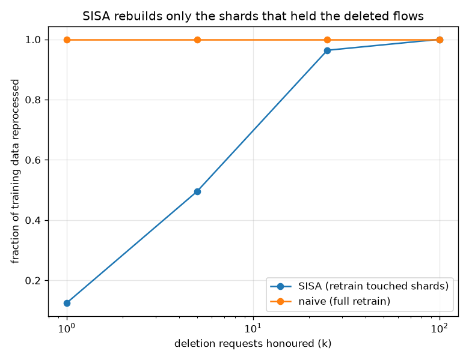

# NetSentry — Machine Unlearning via SISA (delete a flow, exactly and cheaply)

_Synthetic stand-in. Honest temporal/binary split: 28,034 training flows sharded
into isolated submodels. Aggregation averages the shard attack-probabilities._

## Why this report exists

A deployed detector has to be able to **forget** training data — a right-to-be-forgotten
request, a mislabelled flow the [label audit](label_audit.md) caught, a
[backdoor](backdoor.md) row that must come out with proof. Retraining from scratch honours the
request but pays the full training cost every time. SISA (Bourtoule et al., IEEE S&P 2021)
shards the data, trains one isolated submodel per shard, and aggregates — so a deletion
retrains only the shard(s) that held the deleted flows, and the result is *provably identical*
to a fresh model trained on the surviving data. Exact unlearning, at a fraction of the cost.

## The sharding tax: what isolation costs detection

| shards S | test PR-AUC | TPR @ primary FPR |
|---|---|---|
| 1 (monolith) | 0.529 | — |
| 4 | 0.537 | 7.0% |
| 8 | 0.539 | 7.4% |
| 16 | 0.529 | 6.4% |

The sharding tax is mild here: at S = 8 PR-AUC moves only -0.010 from the monolith (0.529 → 0.539), so the cheap-deletion property comes nearly for free on this data — averaging S submodels recovers most of what one model on all of it learns.

## The deletion cost: how little gets rebuilt

Batches of random deletions at S = 8 shards. "Data reprocessed" is the
fraction of training rows the unlearn re-reads; "naive" is the full retrain it replaces.

| deletions k | shards rebuilt (of 8) | expected | data reprocessed | naive |
|---|---|---|---|---|
| 1 | 1.00 | 1.00 | 12.5% | 100% |
| 5 | 3.96 | 3.90 | 49.5% | 100% |
| 25 | 7.71 | 7.72 | 96.4% | 100% |
| 100 | 8.00 | 8.00 | 100.0% | 100% |

A single deletion request rebuilds one shard — 12% of the model, not 100% — and the empirical count matches the coupon-collector expectation exactly (1.00 shard). A batch of 5 random deletions touches 4.0 of 8 shards on average (50% of the data reprocessed vs the naive 100%), tracking its expectation of 3.90. The saving decays with batch size exactly as the theory predicts: by 100 deletions the batch has hit 8.0 shards and nearly the whole model is rebuilt — so SISA is a per-request accelerator, and its edge is largest when deletions arrive spread over time (retrain the touched shard as each request lands), not batched all at once, and it widens with more shards.

## Exactness, verified — and the privacy payoff

Unlearning 5 flows rebuilt 3 of 8 shards (38% of the model). The result is **exact**: the unlearned ensemble's test predictions are identical to a from-scratch ensemble that never saw the deleted flows (max probability difference 0.0e+00). That is the guarantee approximate scrubbing cannot give — there is provably no residue, because the untouched shards were never perturbed and the touched shard was rebuilt from the surviving rows alone. The privacy payoff is measured, not assumed: the deleted flows' membership-confidence signal falls from 0.869 (trained on) to 0.865 after unlearning, toward the 0.743 of flows the model never saw — the Yeom score the [membership](membership.md) study attacks, drained on exactly the rows a right-to-be-forgotten request names.

## Scope

SISA's saving is a per-request expectation: it is largest for deletions spread over time and
shrinks toward a full retrain once a batch touches every shard (the coupon-collector curve
above). The sharding tax is real and is the price paid for cheap deletion — the S knob trades
detection for deletion speed, and the paper's *sliced* refinement (checkpoint within a shard to
retrain only from the affected slice forward) trades storage for a further cut, named here and
not implemented. Exactness holds because sharding and per-shard training are deterministic (the
global seed, `deterministic=True`); it is the guarantee an approximate unlearning method (a few
gradient-ascent steps on the deleted points) cannot make, and the reason SISA is the complement
of [differential privacy](dp.md): DP bounds what a flow can leak *before* deletion, SISA is how
you honour the deletion *after*.