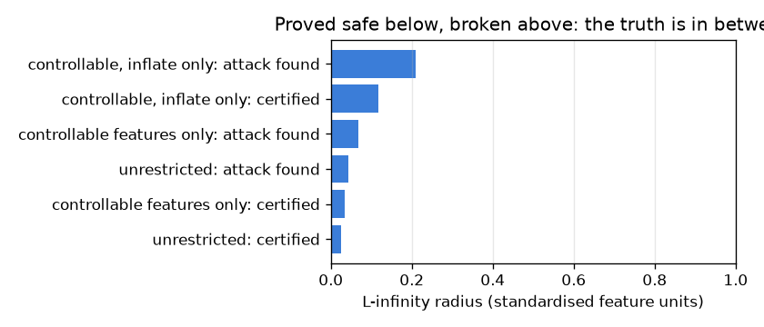
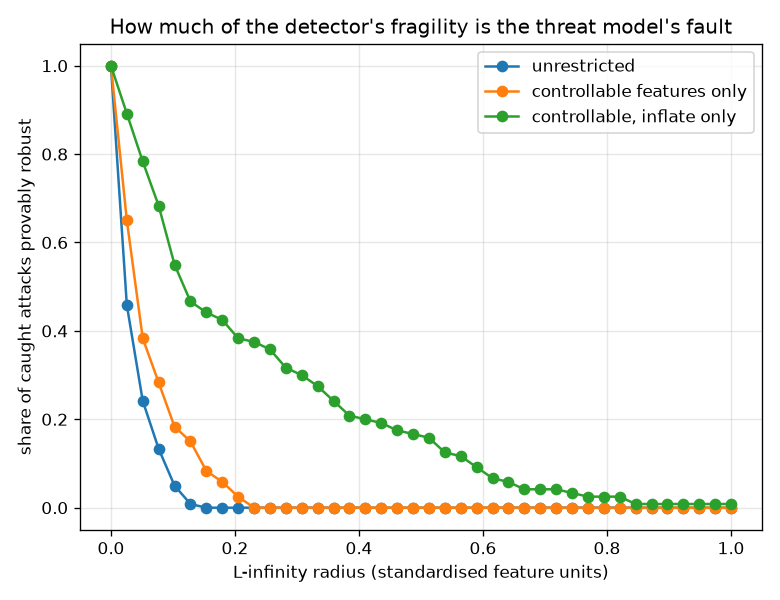

# NetSentry — Deterministic Verification: Proving the Verdict, Not Sampling It

_Synthetic stand-in. Honest temporal/binary split. The deployed ensemble (554 trees,
69,250 nodes) is flattened and verified exactly; radii are L-infinity in the same
standardised feature units the [evasion](robustness.md) and [certification](certify.md) studies
use, at the validated 0.1%-FPR operating point. 120 caught
attack flows verified per threat model._

## Why this report exists

Three reports here ask how far an attacker must push a flow before the detector lets it
through, and they answer with different kinds of statement:

| study | direction | strength | about which model |
|---|---|---|---|
| [evasion](robustness.md) | upper bound | "this attack works" | the deployed one |
| [certified robustness](certify.md) | lower bound | probabilistic, with a confidence level | a *smoothed* surrogate |
| this report | lower bound | **absolute, by arithmetic** | the deployed one |

Gradient-boosted trees are one of the few model families where the third row is available. A
tree ensemble is piecewise-constant over axis-aligned boxes, so its output over an input box can
be bounded by interval arithmetic: at each split, if the box lies wholly on one side, follow that
child; if it straddles the threshold, follow both and keep the extremes. Sum the per-tree minima
and you have a sound lower bound on the ensemble margin over the entire box. If that still clears
the decision threshold, **no** perturbation inside the box can flip the verdict — not "none
found", none.

## First, is it the same model?

A proof about a re-implementation is worth nothing. The flattened arrays are checked against
LightGBM's own `raw_score` on 200 test flows; the largest disagreement is
**1.78e-14**, i.e. floating-point noise. The run aborts rather than
reports if that check fails, because a verification report about an approximation of the deployed
model is worse than no verification report.

## The sandwich

| threat model | features movable | median certified radius | median attack radius | gap | provably robust at the budget | never certified |
|---|---|---|---|---|---|---|
| **unrestricted** | 76 of 76 | 0.024 | 0.043 | 0.016 | 5.0% | 0 of 120 |
| **controllable features only** | 39 of 76 | 0.034 | 0.069 | 0.026 | 18.3% | 0 of 120 |
| **controllable, inflate only** | 39 of 76 | 0.118 | 0.209 | 0.132 | 55.8% | 0 of 120 |

Every flow is bracketed. Below 0.024 (median) the verdict is **provably** unchangeable — arithmetic, not sampling. Above 0.043 (median) an attack that actually exists flips it. The true radius lies between, and the gap is tight enough to be useful — the two bounds are within a small factor, so the interval relaxation is not throwing much away on this ensemble.

## Which adversary are we certifying against?

The three rows are the same proof under three different assumptions about the adversary, and the spread between them is large. Certifying against *any* perturbation of all 76 features — the guarantee most papers report, because it is the cleanest to state — gives a median radius of 0.024, leaving 5.0% of caught attacks provably robust at the 0.10 budget. Restricting to the 39 features an attacker can actually shape raises that to 0.034, and forbidding the physically impossible direction — you can pad a flow, delay it, add dummy packets, but you cannot un-send bytes already on the wire — reaches 0.118, **4.8x** the unrestricted radius, with 55.8% of caught attacks provably robust.

None of those numbers is more correct than the others; they answer different questions. But only the last one answers the question an operator has, and the distance between the first and the last is a measure of how much apparent fragility is an artefact of certifying against an adversary who does not exist. Reporting the unrestricted number alone would understate the detector; reporting only the restricted one would be marketing. Both belong in the table.

## Scope

The bound is **sound but incomplete**. Bounding each tree independently ignores that every tree
reads the same input, so the summed extremes may correspond to a combination of leaves no single
input can realise; the bound therefore never certifies an attackable point, but does refuse to
certify some safe ones. Closing that gap exactly means searching consistent leaf tuples — a
max-clique problem (Chen et al., NeurIPS 2019) — which is not implemented here, and the sandwich
above is the honest substitute: it prices the looseness rather than hiding it. The attack side of
the sandwich is a coordinate-wise best response plus random search, so it is an upper bound from
a specific adversary and a stronger attack would narrow the bracket from above. Verification runs
in the **standardised feature space** the model sees, so a radius of `r` means `r` standard
deviations on every movable feature at once, which is the same convention
[certify.md](certify.md) and [robustness.md](robustness.md) use and lets the three read against
each other. Only attack flows the detector currently catches are verified — the robustness of a
verdict it is already getting wrong is not an interesting quantity. Feature interactions imposed
by the pipeline (a rate and its numerator moving together) are not modelled: the box treats every
feature as independently movable, which makes the certificate conservative in the operator's
favour and the attack optimistic in the attacker's.