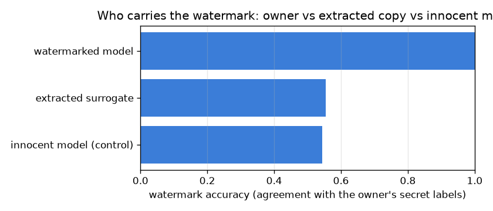

# NetSentry — Model Watermarking (prove you own the detector)

_Synthetic stand-in. Honest temporal/binary split; 256 secret watermark keys with
fair-coin owner labels embedded in training. The ownership test is exact (Binomial null,
log-space tail, no scipy)._

## Why this report exists

The [extraction study](extraction.md) shows a detector can be stolen through its API; this is
the countermeasure that proves it afterwards. Watermarking (Adi et al., USENIX Security 2018)
is the [backdoor](backdoor.md) mechanism turned to the owner's benefit: embed secret trigger
flows with owner-chosen **random** labels during training so the model memorises them, then
prove ownership by querying a suspect on the keys. A watermarked model matches the owner's
labels; an innocent one agrees with the *random* labels only at chance, and because the labels
are fair coins the null is exactly `Binomial(K, 0.5)` — a clean, exact ownership p-value.

## Ownership proof — and the innocent-model control

| model | watermark accuracy | matches / keys | log10 p-value | ownership |
|---|---|---|---|---|
| watermarked model | 100.0% | 256/256 | -77.1 | **proven** |
| extracted surrogate | 55.5% | 142/256 | -1.3 | not shown |
| innocent model (control) | 54.3% | 139/256 | -1.0 | not shown |

The proof is decisive. The watermarked model classifies 100% of the secret keys by the owner's labels (256/256), a match count whose probability under the innocent null (Binomial(256, 0.5)) is 10^-77 — beyond any evidentiary threshold. The control proves the test is safe: the innocent model, which never saw the keys, matches the *random* owner labels 54% of the time (139/256, log10 p -1.0) — exactly the chance rate the fair-coin construction guarantees regardless of its class bias, so an honest model is never falsely accused.

## The fidelity tax

Embedding the watermark is nearly free: temporal PR-AUC moves -0.000 (0.529 clean → 0.529 watermarked), because 256 off-manifold keys memorised in empty feature-space regions do not disturb the decision boundary where real traffic lives.

## Survival under model extraction

The honest limit is extraction. A surrogate stolen through 4,000 queries matches the keys only 55% of the time (log10 p -1.3), near the innocent chance rate: the thief learned the victim's *decision boundary* over real traffic but not its *arbitrary memorised keys*, which live off the manifold the queries never probed. Watermarking robustly proves ownership against a directly copied or fine-tuned model; against a model-extraction thief it is weak — the same honesty the [extraction](extraction.md) study applied to its own attack, and the reason watermarking and query-rate limiting are complementary, not redundant, defenses.

## Scope

The watermark keys are off-manifold random points (Adi et al.'s abstract-trigger construction,
in feature space); a content-aware watermark that hides in plausible flows is the named
alternative and would resist a manifold-filtering adversary this one does not model. The
ownership test assumes the owner registers the keys and their labels in advance (a commitment),
so it cannot be forged after the fact. Robustness is against the threats named: it holds against
copying and fine-tuning and is measured — not assumed — against extraction, where it is weak.
The complement of [differential privacy](dp.md) (which bounds leakage) and
[SISA unlearning](unlearn.md) (which honours deletion): this one asserts *ownership*, the third
governance question a deployed model has to answer.