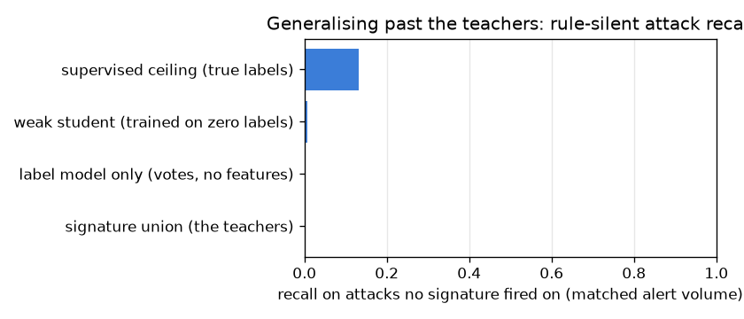

# NetSentry — Weak Supervision (the signatures as teachers)

_Synthetic stand-in. Honest temporal/binary split; 28,034 training flows whose
labels were never shown to the label model or the student. Assumed class balance
0.15 (an operator belief, not tuned to the true 0.20);
label model in **prior-belief mode** — the signatures co-fire on only 1 row, so the agreement gate refused to fit accuracies; the confidence floor kept 100% of training rows. Every
detector is compared at the signature union's own test alert volume
(1,412 alerts against 6,237 true attacks)._

## Why this report exists

Every supervised result in this project assumes labeled training days; a real deployment
starts with none. What it does have is the incumbent signature ruleset. Data programming
(Ratner et al., NeurIPS 2016) treats each signature as a **labeling function** — voting
attack where it fires, abstaining elsewhere — and resolves the votes with a generative
label model, under one operator-supplied belief: a coarse class balance, required because
attack-or-abstain votes cannot identify it (the same reason Snorkel takes
``class_balance`` as an input). The label model is **agreement-gated**: signature
accuracies are estimable from votes only where signatures *co-fire*, so it fits them by
EM when that agreement mass exists and otherwise states a fixed trust and says so. Its
posteriors then train the ordinary downstream model, noise-aware. The question the study
prices: how much of the fully-supervised ceiling does a model trained on **zero labels**
recover, and can it detect attacks **no signature fires on** — where the ruleset's recall
is 0 by definition?

## What the label model can (and cannot) learn without labels

| signature (labeling function) | coverage | model precision (no labels) | true precision | error |
|---|---|---|---|---|
| volumetric-flood | 2.2% | 0.800 | 0.984 | -0.184 |
| port-scan-sweep | 0.2% | 0.800 | 0.067 | +0.733 |
| slow-drip-dos | 0.4% | 0.800 | 0.880 | -0.080 |
| ftp-bruteforce | 0.3% | 0.800 | 1.000 | -0.200 |
| ssh-bruteforce | 0.6% | 0.800 | 0.687 | +0.113 |
| tls-heartbeat-exfil | 0.0% | 0.800 | 0.800 | +0.000 |

The signatures co-fire on only **1** of 28,034 rows — agreement is the sole label-free evidence about a labeling function's accuracy, and with none of it, *no* method (EM, method-of-moments, triplets) can estimate these numbers; an unanchored fit just drifts. The gate therefore refused to fit and the model column states the configured trust (0.80) instead. The true column is the post-hoc audit of that belief — the spread in it is exactly what labels (or overlapping signatures) would have bought. The weak labels themselves agree with the hidden truth on
**82.9%** of training flows.

## Detectors on the honest temporal test split

| detector | PR-AUC | precision @ matched volume | recall @ matched volume | rule-silent attack recall |
|---|---|---|---|---|
| signature union (the teachers) | n/a | 93% | 21% | 0% |
| label model only (votes, no features) | 0.394 | 93% | 21% | 0% |
| weak student (trained on zero labels) | 0.666 | 93% | 21% | 1% |
| supervised ceiling (true labels) | 0.529 | 90% | 20% | 13% |

The audit prices the flat trust: **port-scan-sweep** is actually only 7% precise against the stated 80%, while ftp-bruteforce runs at 100%. With zero co-fire the label model *cannot* discover this from data — the weak labels inherit each signature's real precision as label noise the student has to absorb. The student's reach past its teachers is thin at the matched volume: 1% of the 4,919 rule-silent test attacks, against the supervised ceiling's 13% — taught only by teachers who never alert on those flows, its top alerts stay a smoothed union, reported plainly. End to end, a detector trained on **zero labels** lands a PR-AUC of 0.666 against the fully-supervised ceiling's 0.529 — **126% of the ceiling** — with the incumbent union at 93% precision / 21% recall at its own volume. The weak student *beating* its supervised ceiling on the temporal split is not a paradox: coarse signature-shaped labels encode behaviours that stay stable across days, while true labels let the model fit day-specific patterns that do not survive the shift — the leaderboard's simple-models-win-temporally finding, restated in the label dimension.

## Sensitivity to the assumed class balance

| assumed P(attack) | hidden weak-label accuracy | student PR-AUC |
|---|---|---|
| 0.05 | 82.9% | 0.668 |
| 0.15 (configured) | 82.9% | 0.666 |
| 0.30 | 82.9% | 0.667 |

Misstating the prior by this whole range (0.05 to 0.30, against a true prevalence of 0.20) moves the student's PR-AUC by only 0.002 — the belief has to be *coarse*, not correct.

## Scope

The label model assumes conditionally independent labeling functions wherever it fits at
all, and the agreement gate is the admission that hand-written rulesets — these included —
are usually engineered to be *disjoint*, which puts their accuracies beyond any label-free
estimator; the model-vs-true audit table is therefore part of the contract, not an
appendix. The
teachers may key on `Destination Port` (real signatures are port-scoped) while the
student's pipeline still drops it: weak supervision transfers the signatures' knowledge,
never their memorisation, so the leakage firewall holds in the weak regime too. And the
comparison is deliberately volume-matched — a detector only gets credit it could claim at
the incumbent's own alert budget. What this study does not claim: that weak supervision
replaces labeling. It prices the *starting point* — what a SOC can field before the first
labeled day exists — and the ceiling column is the argument for buying labels next (the
active-learning study prices exactly which ones).